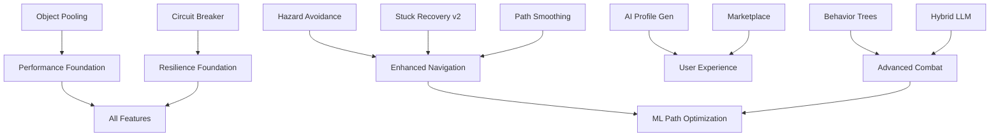

# WowClassicGrindBot - Master Implementation Plan

## Comprehensive Feature Enhancement Roadmap

**Version:** 1.0  
**Date:** February 5, 2026  
**Author:** GitHub Copilot  
**Status:** Production-Ready Specifications

---

## Table of Contents

1. [Executive Summary](#1-executive-summary)
2. [Feature Compatibility Matrix](#2-feature-compatibility-matrix)
3. [Global Guardrails System](#3-global-guardrails-system)
4. [Phase 1: Foundation & Quick Wins](#4-phase-1-foundation--quick-wins)
5. [Phase 2: Enhanced User Experience](#5-phase-2-enhanced-user-experience)
6. [Phase 3: Advanced Intelligence](#6-phase-3-advanced-intelligence)
7. [Phase 4: Long-Term Research](#7-phase-4-long-term-research)
8. [Cross-Cutting Concerns](#8-cross-cutting-concerns)
9. [Rollback Procedures](#9-rollback-procedures)
10. [Security Guardrails](#10-security-guardrails)
11. [Testing Protocols](#11-testing-protocols)
12. [Monitoring & Observability](#12-monitoring--observability)
13. [API Contract Preservation](#13-api-contract-preservation)
14. [Documentation Requirements](#14-documentation-requirements)

---

## 1. Executive Summary

This document provides comprehensive, production-ready implementation plans for modular feature additions identified through cross-repository analysis of the WowClassicGrindBot ecosystem and related projects (AmeisenBotX, LLM-driven variants).

### Key Principles

| Principle | Implementation |
|-----------|----------------|
| **Zero Breaking Changes** | All new features are opt-in via feature flags |
| **Backwards Compatibility** | Existing configurations continue to work unchanged |
| **Graceful Degradation** | Features fail safely without affecting core functionality |
| **Incremental Delivery** | Each phase delivers standalone value |
| **Observable** | All features emit metrics for monitoring |

### Feature Overview

| Phase | Feature | Complexity | Impact | Risk |
|-------|---------|------------|--------|------|
| **1** | Object Pooling | Low | High | Low |
| **1** | Circuit Breaker Pattern | Low | High | Low |
| **1** | Path Smoothing (RDP) | Low | Medium | Low |
| **1** | Enhanced Stuck Recovery | Medium | High | Low |
| **2** | Hazard Avoidance System | Medium | High | Medium |
| **2** | AI Profile Generator | Medium | High | Medium |
| **2** | Profile Marketplace | Medium | Medium | Low |
| **3** | Behavior Tree Combat | High | Medium | Medium |
| **3** | Hybrid GOAP+LLM | High | High | High |
| **4** | ML Path Optimization | Very High | High | High |

---

## 2. Feature Compatibility Matrix

### 2.1 WoW Client Version Compatibility

| Feature | Classic Era | TBC | WotLK | Cata | MoP |
|---------|-------------|-----|-------|------|-----|
| Object Pooling | ✅ | ✅ | ✅ | ✅ | ✅ |
| Circuit Breaker | ✅ | ✅ | ✅ | ✅ | ✅ |
| Path Smoothing | ✅ | ✅ | ✅ | ✅ | ✅ |
| Stuck Recovery v2 | ✅ | ✅ | ✅ | ✅ | ✅ |
| Hazard Avoidance | ✅ | ✅ | ✅ | ✅ | ✅ |
| AI Profile Generator | ✅ | ✅ | ✅ | ✅ | ✅ |
| Profile Marketplace | ✅ | ✅ | ✅ | ✅ | ✅ |
| Behavior Trees | ✅ | ✅ | ✅ | ✅ | ✅ |
| Hybrid LLM | ✅ | ✅ | ✅ | ✅ | ✅ |
| ML Path Opt | ✅¹ | ✅¹ | ✅¹ | ✅¹ | ✅¹ |

¹ Requires training data per expansion/zone; initial models limited to popular zones.

### 2.2 Navigation Backend Compatibility

| Feature | Local (PPather) | RemoteV1 (HTTP) | RemoteV3 (TCP) |
|---------|-----------------|-----------------|----------------|
| Path Smoothing | ✅ | ✅ | ✅ |
| Hazard Injection | ✅ | ✅² | ✅ |
| Stuck Recovery | ✅ | ✅ | ✅ |

² RemoteV1 requires path post-processing; hazard cost cannot be injected server-side.

### 2.3 Feature Interdependencies



### 2.4 Upgrade Path Matrix

| From Version | To Version | Data Migration | Config Migration | Breaking Changes |
|--------------|------------|----------------|------------------|------------------|
| Pre-Feature | Phase 1 | None | None | None |
| Phase 1 | Phase 2 | Auto (hazard JSON) | Optional flags | None |
| Phase 2 | Phase 3 | None | Optional conversion | None |
| Any | Any | Backwards compatible | Backwards compatible | None |

---

## 3. Global Guardrails System

### 3.1 Feature Flags Architecture

**File:** `BlazorServer/runtime_feature_flags.json`

```json
{
  "Features": {
    "ObjectPooling": {
      "Enabled": true,
      "RolloutPercentage": 100
    },
    "CircuitBreaker": {
      "Enabled": true,
      "PathfindingThreshold": 5,
      "PathfindingCooldownSeconds": 60
    },
    "PathSmoothing": {
      "Enabled": true,
      "RDPTolerance": 2.0
    },
    "StuckRecoveryV2": {
      "Enabled": true,
      "BreadcrumbTrailSize": 50,
      "EmergencyHearthstoneThreshold": 10
    },
    "HazardAvoidance": {
      "Enabled": false,
      "DBSCANEpsilon": 15.0,
      "DBSCANMinPoints": 2,
      "HazardCostMultiplier": 10.0,
      "DecayHalfLifeDays": 30
    },
    "AIProfileGenerator": {
      "Enabled": false,
      "APIProvider": "none",
      "MaxTokensPerRequest": 4000,
      "RateLimitPerHour": 20
    },
    "ProfileMarketplace": {
      "Enabled": false,
      "RepositoryUrl": "https://api.github.com/repos/Xian55/WowClassicGrindBot-Profiles"
    },
    "BehaviorTreeCombat": {
      "Enabled": false,
      "FallbackToGOAP": true
    },
    "HybridLLMDecision": {
      "Enabled": false,
      "ConfidenceThreshold": 0.6,
      "MaxLatencyMs": 2000
    }
  },
  "GlobalKillSwitch": false,
  "DebugMode": false
}
```

**Implementation Pattern:**

```csharp
// Core/FeatureFlags/FeatureFlagsOptions.cs
namespace Core.FeatureFlags;

public sealed class FeatureFlagsOptions
{
    public const string Position = "Features";
    
    public ObjectPoolingOptions ObjectPooling { get; set; } = new();
    public CircuitBreakerOptions CircuitBreaker { get; set; } = new();
    public PathSmoothingOptions PathSmoothing { get; set; } = new();
    public StuckRecoveryV2Options StuckRecoveryV2 { get; set; } = new();
    public HazardAvoidanceOptions HazardAvoidance { get; set; } = new();
    public AIProfileGeneratorOptions AIProfileGenerator { get; set; } = new();
    public ProfileMarketplaceOptions ProfileMarketplace { get; set; } = new();
    public BehaviorTreeCombatOptions BehaviorTreeCombat { get; set; } = new();
    public HybridLLMDecisionOptions HybridLLMDecision { get; set; } = new();
    
    public bool GlobalKillSwitch { get; set; }
    public bool DebugMode { get; set; }
}

public sealed class ObjectPoolingOptions
{
    public bool Enabled { get; set; } = true;
    public int RolloutPercentage { get; set; } = 100;
}

// Pattern for checking feature state
public static class FeatureFlagExtensions
{
    public static bool IsEnabled(this FeatureFlagsOptions flags, string featureName)
    {
        if (flags.GlobalKillSwitch) return false;
        
        return featureName switch
        {
            "ObjectPooling" => flags.ObjectPooling.Enabled,
            "CircuitBreaker" => flags.CircuitBreaker.Enabled,
            "HazardAvoidance" => flags.HazardAvoidance.Enabled,
            // ... etc
            _ => false
        };
    }
}
```

### 3.2 Circuit Breaker Pattern

**Purpose:** Prevent cascading failures when external services (pathfinding APIs, LLM APIs) are unavailable.

**Implementation:**

```csharp
// Core/Resilience/CircuitBreaker.cs
namespace Core.Resilience;

public enum CircuitState { Closed, Open, HalfOpen }

public sealed class CircuitBreaker<TResult>
{
    private readonly ILogger _logger;
    private readonly int _failureThreshold;
    private readonly TimeSpan _cooldownPeriod;
    private readonly Func<TResult> _fallback;
    
    private int _failureCount;
    private DateTime _lastFailure;
    private CircuitState _state = CircuitState.Closed;
    private readonly object _lock = new();
    
    public CircuitBreaker(
        ILogger logger,
        int failureThreshold,
        TimeSpan cooldownPeriod,
        Func<TResult> fallback)
    {
        _logger = logger;
        _failureThreshold = failureThreshold;
        _cooldownPeriod = cooldownPeriod;
        _fallback = fallback;
    }
    
    public CircuitState State => _state;
    
    public async Task<TResult> ExecuteAsync(Func<Task<TResult>> action)
    {
        lock (_lock)
        {
            if (_state == CircuitState.Open)
            {
                if (DateTime.UtcNow - _lastFailure >= _cooldownPeriod)
                {
                    _state = CircuitState.HalfOpen;
                    _logger.LogInformation(
                        "[CircuitBreaker   ] Entering half-open state after cooldown");
                }
                else
                {
                    _logger.LogDebug(
                        "[CircuitBreaker   ] Circuit open, using fallback");
                    return _fallback();
                }
            }
        }
        
        try
        {
            TResult result = await action();
            
            lock (_lock)
            {
                if (_state == CircuitState.HalfOpen)
                {
                    _state = CircuitState.Closed;
                    _failureCount = 0;
                    _logger.LogInformation(
                        "[CircuitBreaker   ] Circuit closed - service recovered");
                }
            }
            
            return result;
        }
        catch (Exception ex)
        {
            lock (_lock)
            {
                _failureCount++;
                _lastFailure = DateTime.UtcNow;
                
                if (_failureCount >= _failureThreshold)
                {
                    _state = CircuitState.Open;
                    _logger.LogWarning(
                        "[CircuitBreaker   ] Circuit opened after {Count} failures: {Error}",
                        _failureCount, ex.Message);
                }
            }
            
            return _fallback();
        }
    }
    
    public void Reset()
    {
        lock (_lock)
        {
            _state = CircuitState.Closed;
            _failureCount = 0;
        }
    }
}
```

### 3.3 Validation Checkpoints

Each feature must implement validation checkpoints:

```csharp
// Core/Validation/IValidationCheckpoint.cs
namespace Core.Validation;

public interface IValidationCheckpoint
{
    string Name { get; }
    ValidationResult Validate();
    Task<ValidationResult> ValidateAsync();
}

public record ValidationResult(
    bool IsValid,
    string? ErrorMessage = null,
    Dictionary<string, object>? Context = null);

// Example implementation
public sealed class HazardSystemValidation : IValidationCheckpoint
{
    private readonly HazardZoneStore _store;
    private readonly IHazardProvider _provider;
    
    public string Name => "HazardAvoidanceSystem";
    
    public ValidationResult Validate()
    {
        // Check store integrity
        if (_store.EventCount > 100000)
            return new(false, "Event count exceeds safe limit");
        
        // Verify spatial index
        if (!_store.VerifySpatialIndex())
            return new(false, "Spatial index corrupted");
        
        // Test hazard cost calculation
        var testCost = _provider.GetHazardCost(Vector3.Zero, 0);
        if (float.IsNaN(testCost) || float.IsInfinity(testCost))
            return new(false, "Hazard cost calculation returns invalid values");
        
        return new(true);
    }
}
```

### 3.4 Monitoring Thresholds

**Metrics to Track:**

| Metric | Warning Threshold | Critical Threshold | Action |
|--------|-------------------|-------------------|--------|
| `pathfinding_latency_ms` | > 500ms | > 2000ms | Trip circuit breaker |
| `hazard_cluster_count` | > 1000 | > 5000 | Prune stale data |
| `llm_request_latency_ms` | > 3000ms | > 10000ms | Fallback to GOAP |
| `stuck_recovery_attempts` | > 5 | > 10 | Use hearthstone |
| `memory_usage_mb` | > 500 | > 1000 | Force GC, reduce cache |
| `frame_processing_ms` | > 100ms | > 200ms | Disable optional features |

**Implementation:**

```csharp
// Core/Monitoring/MetricsCollector.cs
namespace Core.Monitoring;

public sealed class MetricsCollector
{
    private readonly ConcurrentDictionary<string, MetricValue> _metrics = new();
    private readonly ILogger<MetricsCollector> _logger;
    
    public void RecordLatency(string name, double ms)
    {
        _metrics.AddOrUpdate(name,
            _ => new MetricValue(ms, 1),
            (_, existing) => existing with
            {
                Value = (existing.Value * existing.Count + ms) / (existing.Count + 1),
                Count = existing.Count + 1
            });
        
        CheckThresholds(name, ms);
    }
    
    public void RecordGauge(string name, double value)
    {
        _metrics.AddOrUpdate(name,
            _ => new MetricValue(value, 1),
            (_, _) => new MetricValue(value, 1));
        
        CheckThresholds(name, value);
    }
    
    private void CheckThresholds(string name, double value)
    {
        var thresholds = MetricThresholds.Get(name);
        if (thresholds == null) return;
        
        if (value >= thresholds.Critical)
        {
            _logger.LogError(
                "[MetricsCollector ] CRITICAL: {Metric} = {Value} (threshold: {Threshold})",
                name, value, thresholds.Critical);
            OnCriticalThresholdExceeded?.Invoke(name, value);
        }
        else if (value >= thresholds.Warning)
        {
            _logger.LogWarning(
                "[MetricsCollector ] WARNING: {Metric} = {Value} (threshold: {Threshold})",
                name, value, thresholds.Warning);
            OnWarningThresholdExceeded?.Invoke(name, value);
        }
    }
    
    public event Action<string, double>? OnWarningThresholdExceeded;
    public event Action<string, double>? OnCriticalThresholdExceeded;
}

public record MetricValue(double Value, long Count);

public static class MetricThresholds
{
    private static readonly FrozenDictionary<string, (double Warning, double Critical)> 
        Thresholds = new Dictionary<string, (double, double)>
    {
        ["pathfinding_latency_ms"] = (500, 2000),
        ["hazard_cluster_count"] = (1000, 5000),
        ["llm_request_latency_ms"] = (3000, 10000),
        ["stuck_recovery_attempts"] = (5, 10),
        ["memory_usage_mb"] = (500, 1000),
        ["frame_processing_ms"] = (100, 200)
    }.ToFrozenDictionary();
    
    public static (double Warning, double Critical)? Get(string name) =>
        Thresholds.TryGetValue(name, out var t) ? t : null;
}
```

---

## 4. Phase 1: Foundation & Quick Wins

**Timeline:** 1-2 weeks  
**Risk Level:** Low  
**Breaking Changes:** None

### 4.1 Object Pooling

**Problem:** Combat loops create temporary objects causing GC pressure.

**Source Attribution:** Pattern derived from `noisiver/AmeisenBotX/Core/Cache/ObjectCache.cs`

**Implementation:**

```csharp
// Core/Performance/ObjectPool.cs
namespace Core.Performance;

/// <summary>
/// Generic object pool to reduce GC pressure in hot paths.
/// Thread-safe using ConcurrentBag for multi-threaded access.
/// </summary>
public sealed class ObjectPool<T> where T : class, new()
{
    private readonly ConcurrentBag<T> _pool = new();
    private readonly int _maxSize;
    private int _currentSize;
    
    public ObjectPool(int maxSize = 100)
    {
        _maxSize = maxSize;
    }
    
    public T Rent()
    {
        if (_pool.TryTake(out T? item))
        {
            Interlocked.Decrement(ref _currentSize);
            return item;
        }
        return new T();
    }
    
    public void Return(T item)
    {
        if (Interlocked.Increment(ref _currentSize) <= _maxSize)
        {
            if (item is IResettable resettable)
                resettable.Reset();
            
            _pool.Add(item);
        }
        else
        {
            Interlocked.Decrement(ref _currentSize);
            // Let GC handle overflow
        }
    }
}

public interface IResettable
{
    void Reset();
}
```

**Files to Create:**
- [Core/Performance/ObjectPool.cs](Core/Performance/ObjectPool.cs)
- [Core/Performance/IResettable.cs](Core/Performance/IResettable.cs)

**Integration Points:**
- `Core/GoalsComponent/CastingHandler.cs` - Pool KeyAction evaluation results
- `Core/Goals/CombatGoal.cs` - Pool target evaluation structs

**Verification:**
```bash
dotnet build MasterOfPuppets.sln
dotnet run --project Benchmarks -- --filter "*ObjectPool*"
```

**Rollback:** Remove pool usage, revert to direct instantiation (no data impact).

---

### 4.2 Circuit Breaker for Pathfinding

**Problem:** PathfindingAPI failures cause repeated timeouts, degrading user experience.

**Implementation:**

```csharp
// Modify: Core/PPather/RemotePathingAPIV3.cs

private readonly CircuitBreaker<List<Vector3>> _circuitBreaker;

public RemotePathingAPIV3(ILogger<RemotePathingAPIV3> logger, 
    IOptions<FeatureFlagsOptions> options,
    PPatherService service,
    DataConfig dataConfig)
{
    // ... existing code ...
    
    var flags = options.Value.CircuitBreaker;
    _circuitBreaker = new CircuitBreaker<List<Vector3>>(
        logger,
        failureThreshold: flags.PathfindingThreshold,
        cooldownPeriod: TimeSpan.FromSeconds(flags.PathfindingCooldownSeconds),
        fallback: () => new List<Vector3>() // Empty path forces local fallback
    );
}

public async Task<List<Vector3>> FindRouteTo(Vector3 from, Vector3 to)
{
    if (!_options.Value.CircuitBreaker.Enabled)
        return await FindRouteToInternal(from, to);
    
    return await _circuitBreaker.ExecuteAsync(
        () => FindRouteToInternal(from, to));
}
```

**Files to Create:**
- [Core/Resilience/CircuitBreaker.cs](Core/Resilience/CircuitBreaker.cs)
- [Core/Resilience/CircuitBreakerOptions.cs](Core/Resilience/CircuitBreakerOptions.cs)

**Files to Modify:**
- [Core/PPather/RemotePathingAPIV3.cs](Core/PPather/RemotePathingAPIV3.cs#L45) - Wrap API calls
- [Core/PPather/RemotePathingAPIV1.cs](Core/PPather/RemotePathingAPIV1.cs#L38) - Wrap HTTP calls

**Verification:**
```bash
# Integration test with mocked failing server
dotnet test --filter "FullyQualifiedName~CircuitBreaker"
```

**Rollback:** Set `CircuitBreaker.Enabled = false` in runtime config.

---

### 4.3 Path Smoothing (Ramer-Douglas-Peucker)

**Problem:** Recorded paths have excessive waypoints (1 point/second).

**Source Attribution:** Algorithm from `noisiver/AmeisenBotX/Engines/Movement/PathSmoothing.cs`

**Implementation:**

```csharp
// Core/Navigation/PathSimplifier.cs
namespace Core.Navigation;

using System.Numerics;

/// <summary>
/// Applies Ramer-Douglas-Peucker algorithm to reduce path complexity
/// while preserving shape within tolerance.
/// </summary>
public static class PathSimplifier
{
    /// <summary>
    /// Simplifies a path by removing redundant points.
    /// </summary>
    /// <param name="path">Original path waypoints</param>
    /// <param name="tolerance">Maximum allowed perpendicular distance (world units)</param>
    /// <returns>Simplified path</returns>
    public static List<Vector3> Simplify(IReadOnlyList<Vector3> path, float tolerance = 2.0f)
    {
        if (path.Count < 3)
            return path.ToList();
        
        return RamerDouglasPeucker(path, 0, path.Count - 1, tolerance);
    }
    
    private static List<Vector3> RamerDouglasPeucker(
        IReadOnlyList<Vector3> points, 
        int start, 
        int end, 
        float epsilon)
    {
        float dmax = 0f;
        int index = start;
        
        for (int i = start + 1; i < end; i++)
        {
            float d = PerpendicularDistance(points[i], points[start], points[end]);
            if (d > dmax)
            {
                index = i;
                dmax = d;
            }
        }
        
        if (dmax > epsilon)
        {
            var left = RamerDouglasPeucker(points, start, index, epsilon);
            var right = RamerDouglasPeucker(points, index, end, epsilon);
            
            // Combine results, avoiding duplicate at junction
            var result = new List<Vector3>(left.Count + right.Count - 1);
            result.AddRange(left);
            result.AddRange(right.Skip(1));
            return result;
        }
        
        return new List<Vector3> { points[start], points[end] };
    }
    
    private static float PerpendicularDistance(Vector3 point, Vector3 lineStart, Vector3 lineEnd)
    {
        Vector3 line = lineEnd - lineStart;
        float lineLengthSq = line.LengthSquared();
        
        if (lineLengthSq == 0)
            return Vector3.Distance(point, lineStart);
        
        float t = Math.Clamp(Vector3.Dot(point - lineStart, line) / lineLengthSq, 0, 1);
        Vector3 projection = lineStart + t * line;
        
        return Vector3.Distance(point, projection);
    }
}
```

**Integration:**

```csharp
// Modify: Core/GoalsComponent/Navigation.cs

public void SetPath(List<Vector3> path)
{
    if (_featureFlags.PathSmoothing.Enabled && path.Count > 3)
    {
        float tolerance = _featureFlags.PathSmoothing.RDPTolerance;
        path = PathSimplifier.Simplify(path, tolerance);
        
        _logger.LogDebug(
            "[Navigation       ] Path simplified: {Original} → {Simplified} waypoints",
            _originalCount, path.Count);
    }
    
    // ... existing path assignment ...
}
```

**Files to Create:**
- [Core/Navigation/PathSimplifier.cs](Core/Navigation/PathSimplifier.cs)

**Files to Modify:**
- [Core/GoalsComponent/Navigation.cs](Core/GoalsComponent/Navigation.cs#L120) - Apply simplification

**Verification:**
```bash
dotnet run --project Benchmarks -- --filter "*PathSimplifier*"
```

**Rollback:** Set `PathSmoothing.Enabled = false`.

---

### 4.4 Enhanced Stuck Recovery System

**Problem:** Current stuck recovery has limited strategies; complex terrain causes persistent stuck states.

**User Stories:**
- US-SR-1: As a user, I want the bot to track recent positions (breadcrumb trail)
- US-SR-2: As a user, I want graduated recovery strategies (escalating severity)
- US-SR-3: As a user, I want automatic hearthstone use as last resort

**Implementation:**

```csharp
// Core/GoalsComponent/BreadcrumbTracker.cs
namespace Core;

public sealed class BreadcrumbTracker
{
    private readonly Queue<Vector3> _trail = new();
    private readonly int _maxSize;
    
    public BreadcrumbTracker(int maxSize = 50)
    {
        _maxSize = maxSize;
    }
    
    public void RecordPosition(Vector3 position)
    {
        if (_trail.Count >= _maxSize)
            _trail.Dequeue();
        
        // Only record if moved significantly
        if (_trail.Count == 0 || 
            Vector3.Distance(_trail.Last(), position) > 5f)
        {
            _trail.Enqueue(position);
        }
    }
    
    public Vector3? GetBacktrackPosition(int stepsBack)
    {
        if (_trail.Count <= stepsBack)
            return null;
        
        return _trail.ElementAt(_trail.Count - 1 - stepsBack);
    }
    
    public void Clear() => _trail.Clear();
}

// Core/GoalsComponent/RecoveryStrategy.cs
namespace Core;

public interface IRecoveryStrategy
{
    string Name { get; }
    int Priority { get; }
    TimeSpan Timeout { get; }
    Task<bool> ExecuteAsync(CancellationToken ct);
}

public sealed class BacktrackStrategy : IRecoveryStrategy
{
    private readonly Navigation _navigation;
    private readonly BreadcrumbTracker _tracker;
    
    public string Name => "Backtrack";
    public int Priority => 2;
    public TimeSpan Timeout => TimeSpan.FromSeconds(5);
    
    public async Task<bool> ExecuteAsync(CancellationToken ct)
    {
        var backtrackPos = _tracker.GetBacktrackPosition(3);
        if (backtrackPos == null) return false;
        
        // Request new path to backtrack position
        _navigation.SetDestination(backtrackPos.Value);
        
        // Wait for movement
        await Task.Delay(3000, ct);
        
        return true; // Let navigation verify if we moved
    }
}

public sealed class HearthstoneStrategy : IRecoveryStrategy
{
    private readonly ExecGameCommand _exec;
    
    public string Name => "Hearthstone";
    public int Priority => 10; // Last resort
    public TimeSpan Timeout => TimeSpan.FromSeconds(15);
    
    public async Task<bool> ExecuteAsync(CancellationToken ct)
    {
        // Use hearthstone via game command
        await _exec.ExecuteAsync("/use Hearthstone");
        await Task.Delay(12000, ct); // Cast time + buffer
        return true;
    }
}
```

**Files to Create:**
- [Core/GoalsComponent/BreadcrumbTracker.cs](Core/GoalsComponent/BreadcrumbTracker.cs)
- [Core/GoalsComponent/RecoveryStrategy.cs](Core/GoalsComponent/RecoveryStrategy.cs)
- [Core/GoalsComponent/RecoveryStrategyExecutor.cs](Core/GoalsComponent/RecoveryStrategyExecutor.cs)

**Files to Modify:**
- [Core/GoalsComponent/StuckDetector.cs](Core/GoalsComponent/StuckDetector.cs) - Add strategy execution

**Feature Flag:**
```json
{
  "StuckRecoveryV2": {
    "Enabled": true,
    "BreadcrumbTrailSize": 50,
    "EmergencyHearthstoneThreshold": 10
  }
}
```

**Rollback:** Set `StuckRecoveryV2.Enabled = false` to use original stuck detection.

---

## 5. Phase 2: Enhanced User Experience

**Timeline:** 3-4 weeks  
**Risk Level:** Medium  
**Breaking Changes:** None

### 5.1 Hazard Avoidance System

**Status:** ✅ Implemented (Feb 5, 2026) - feature-flagged off by default (see `BlazorServer/runtime_feature_flags.json`)

**Summary:**
- DBSCAN clustering of stuck/death events
- A* cost injection for path avoidance
- 30-day exponential decay
- Leaflet.heat visualization
- Debug API endpoints (`/api/debug/hazards/...`) for runtime validation

**Key Milestones:**

| Milestone | Deliverable | Duration | Dependencies |
|-----------|-------------|----------|--------------|
| M1 | Data models & persistence | 2 days | None |
| M2 | Event collection | 2 days | M1 |
| M3 | DBSCAN clustering | 3 days | M2 |
| M4 | A* integration | 2 days | M3 |
| M5 | UI visualization | 2 days | M4 |
| M6 | Integration testing | 2 days | M5 |

**Feature Flag:**
```json
{
  "HazardAvoidance": {
    "Enabled": false,
    "DBSCANEpsilon": 15.0,
    "DBSCANMinPoints": 2,
    "HazardCostMultiplier": 10.0,
    "DecayHalfLifeDays": 30
  }
}
```

---

### 5.2 AI Profile Generator

**Problem:** Creating class profiles requires deep JSON knowledge. Barrier to entry for new users.

**Source Attribution:** Concept from `bizkut/AmeisenBotX/Core/Engines/AI/LLMDecisionEngine.cs`

**User Stories:**

| ID | Story | Acceptance Criteria |
|----|-------|---------------------|
| US-AI-1 | As a new user, I want to describe my character in plain text | Profile generated from "Level 30 Frost Mage in Hillsbrad" |
| US-AI-2 | As an advanced user, I want to refine generated profiles | Edit/merge suggestions with existing profiles |
| US-AI-3 | As a user, I want offline-first experience | Local model fallback when API unavailable |

**Architecture:**

```
┌─────────────────┐
│ User Input      │
│ "Frost Mage 30" │
└────────┬────────┘
         │
         ▼
┌─────────────────┐
│ Prompt Builder  │
│ (Context aware) │
└────────┬────────┘
         │
         ├──────────────────┐
         ▼                  ▼
┌─────────────────┐ ┌─────────────────┐
│ Cloud LLM       │ │ Local LLM       │
│ (GPT-4/Claude)  │ │ (llama.cpp)     │
└────────┬────────┘ └────────┬────────┘
         │                   │
         └─────────┬─────────┘
                   │
                   ▼
         ┌─────────────────┐
         │ Profile Parser  │
         │ (JSON validate) │
         └────────┬────────┘
                  │
                  ▼
         ┌─────────────────┐
         │ Preview/Edit UI │
         └────────┬────────┘
                  │
                  ▼
         ┌─────────────────┐
         │ Save to         │
         │ Json/class/     │
         └─────────────────┘
```

**Implementation:**

```csharp
// Core/AI/ProfileGenerator/AIProfileGeneratorService.cs
namespace Core.AI.ProfileGenerator;

public sealed class AIProfileGeneratorService
{
    private readonly ILogger<AIProfileGeneratorService> _logger;
    private readonly ILLMClient _llmClient;
    private readonly ProfileValidator _validator;
    private readonly SpellDB _spellDb;
    
    public async Task<ProfileGenerationResult> GenerateProfileAsync(
        string userDescription,
        CancellationToken ct = default)
    {
        var prompt = BuildPrompt(userDescription);
        
        _logger.LogInformation(
            "[AIProfileGen     ] Generating profile for: {Description}", 
            userDescription);
        
        string response = await _llmClient.CompleteAsync(prompt, ct);
        
        // Extract JSON from response (may be wrapped in markdown)
        string json = ExtractJson(response);
        
        // Validate against schema
        var validation = _validator.Validate(json);
        if (!validation.IsValid)
        {
            _logger.LogWarning(
                "[AIProfileGen     ] Generated profile failed validation: {Errors}",
                string.Join(", ", validation.Errors));
            
            return new ProfileGenerationResult(
                Success: false,
                Profile: null,
                Errors: validation.Errors);
        }
        
        var profile = JsonSerializer.Deserialize<ClassConfiguration>(json);
        
        return new ProfileGenerationResult(
            Success: true,
            Profile: profile,
            Errors: Array.Empty<string>());
    }
    
    private string BuildPrompt(string userDescription)
    {
        // Include available spells for accuracy
        var spellList = string.Join(", ", _spellDb.GetAllSpellNames());
        
        return $"""
            Generate a WowClassicGrindBot JSON profile for: {userDescription}
            
            Available spells in database: {spellList}
            
            Required JSON schema:
            {{
              "ClassName": "string (e.g., Mage)",
              "PathFilename": "string (zone_route.json)",
              "Mode": "Grinding",
              "Combat": {{
                "Sequence": [
                  {{
                    "Name": "SpellName",
                    "Key": "ConsoleKey",
                    "Requirements": ["Requirement:Expression"],
                    "HasCastBar": true/false
                  }}
                ]
              }},
              "Adhoc": {{
                "Sequence": [/* buff/consumable abilities */]
              }},
              "Pull": {{
                "Sequence": [/* initial pull ability */]
              }}
            }}
            
            Guidelines:
            1. Use abilities appropriate for the level range
            2. Include mana/health management thresholds
            3. Add buff maintenance in Adhoc
            4. Order combat rotation by priority (most important first)
            
            Return ONLY valid JSON, no explanations.
            """;
    }
    
    private static string ExtractJson(string response)
    {
        // Handle markdown code blocks
        var match = Regex.Match(response, @"```json?\s*([\s\S]*?)\s*```");
        if (match.Success)
            return match.Groups[1].Value;
        
        // Try to find JSON object directly
        int start = response.IndexOf('{');
        int end = response.LastIndexOf('}');
        if (start >= 0 && end > start)
            return response.Substring(start, end - start + 1);
        
        return response;
    }
}

public record ProfileGenerationResult(
    bool Success,
    ClassConfiguration? Profile,
    IReadOnlyList<string> Errors);
```

**LLM Client Abstraction:**

```csharp
// Core/AI/LLM/ILLMClient.cs
namespace Core.AI.LLM;

public interface ILLMClient
{
    string ProviderName { get; }
    Task<string> CompleteAsync(string prompt, CancellationToken ct = default);
    Task<bool> IsAvailableAsync();
}

// Core/AI/LLM/OpenAIClient.cs
public sealed class OpenAIClient : ILLMClient
{
    private readonly HttpClient _http;
    private readonly string _apiKey;
    private readonly string _model;
    
    public string ProviderName => "OpenAI";
    
    public async Task<string> CompleteAsync(string prompt, CancellationToken ct)
    {
        var request = new
        {
            model = _model,
            messages = new[]
            {
                new { role = "system", content = "You are a WoW bot configuration expert." },
                new { role = "user", content = prompt }
            },
            temperature = 0.3,
            max_tokens = 4000
        };
        
        var response = await _http.PostAsJsonAsync(
            "https://api.openai.com/v1/chat/completions",
            request,
            ct);
        
        var result = await response.Content.ReadFromJsonAsync<OpenAIResponse>(ct);
        return result?.Choices?[0]?.Message?.Content ?? "";
    }
}

// Core/AI/LLM/LocalLlamaClient.cs
public sealed class LocalLlamaClient : ILLMClient
{
    private readonly string _modelPath;
    
    public string ProviderName => "LocalLlama";
    
    // Integration with llama.cpp via P/Invoke or HTTP wrapper
    public async Task<string> CompleteAsync(string prompt, CancellationToken ct)
    {
        // Local inference - no API cost
        // Requires model file in Models/ directory
        throw new NotImplementedException("Local LLM requires llama.cpp integration");
    }
}
```

**Files to Create:**
- [Core/AI/ProfileGenerator/AIProfileGeneratorService.cs](Core/AI/ProfileGenerator/AIProfileGeneratorService.cs)
- [Core/AI/ProfileGenerator/ProfileValidator.cs](Core/AI/ProfileGenerator/ProfileValidator.cs)
- [Core/AI/LLM/ILLMClient.cs](Core/AI/LLM/ILLMClient.cs)
- [Core/AI/LLM/OpenAIClient.cs](Core/AI/LLM/OpenAIClient.cs)
- [Core/AI/LLM/LocalLlamaClient.cs](Core/AI/LLM/LocalLlamaClient.cs)
- [Frontend/Pages/ProfileGenerator.razor](Frontend/Pages/ProfileGenerator.razor)

**Security Considerations:**
- API keys stored in environment variables, NOT in config files
- Rate limiting to prevent cost overruns
- Prompt injection filtering
- Output validation before file write

**Feature Flag:**
```json
{
  "AIProfileGenerator": {
    "Enabled": false,
    "APIProvider": "none",
    "MaxTokensPerRequest": 4000,
    "RateLimitPerHour": 20
  }
}
```

**Rollback:** Disable feature flag; no persistent data to migrate.

---

### 5.3 Community Profile Marketplace

**Problem:** Users reinvent the wheel creating similar profiles. No easy sharing mechanism.

**Architecture:**

```
┌─────────────────┐
│ Marketplace UI  │
│ (Blazor)        │
└────────┬────────┘
         │
         ▼
┌─────────────────┐
│ GitHub API      │
│ (Rate limited)  │
└────────┬────────┘
         │
         ▼
┌─────────────────┐
│ Profile Index   │
│ (Cached JSON)   │
└────────┬────────┘
         │
         ├──────────────────┐
         ▼                  ▼
┌─────────────────┐ ┌─────────────────┐
│ Preview Mode    │ │ Download        │
│ (Read only)     │ │ (File write)    │
└─────────────────┘ └─────────────────┘
```

**Implementation:**

```csharp
// Core/Marketplace/ProfileMarketplaceService.cs
namespace Core.Marketplace;

public sealed class ProfileMarketplaceService
{
    private readonly HttpClient _http;
    private readonly ILogger<ProfileMarketplaceService> _logger;
    private readonly DataConfig _dataConfig;
    private ProfileIndex? _cachedIndex;
    private DateTime _lastFetch;
    
    private const string RepoUrl = 
        "https://api.github.com/repos/Xian55/WowClassicGrindBot-Profiles";
    
    public async Task<IReadOnlyList<ProfileListing>> SearchProfilesAsync(
        ProfileSearchCriteria criteria, 
        CancellationToken ct = default)
    {
        var index = await GetIndexAsync(ct);
        
        return index.Profiles
            .Where(p => criteria.ClassName == null || 
                        p.ClassName.Equals(criteria.ClassName, StringComparison.OrdinalIgnoreCase))
            .Where(p => criteria.LevelRange == null || 
                        p.LevelRange.Overlaps(criteria.LevelRange))
            .Where(p => string.IsNullOrEmpty(criteria.SearchText) ||
                        p.Description.Contains(criteria.SearchText, StringComparison.OrdinalIgnoreCase))
            .OrderByDescending(p => p.Downloads)
            .Take(criteria.MaxResults)
            .ToList();
    }
    
    public async Task<DownloadResult> DownloadProfileAsync(
        string profileId, 
        CancellationToken ct = default)
    {
        var index = await GetIndexAsync(ct);
        var listing = index.Profiles.FirstOrDefault(p => p.Id == profileId);
        
        if (listing == null)
            return new DownloadResult(false, "Profile not found");
        
        // Download raw content
        string content = await _http.GetStringAsync(listing.DownloadUrl, ct);
        
        // Validate JSON
        try
        {
            JsonSerializer.Deserialize<ClassConfiguration>(content);
        }
        catch (JsonException ex)
        {
            return new DownloadResult(false, $"Invalid profile format: {ex.Message}");
        }
        
        // Save to local directory
        string targetPath = Path.Combine(
            _dataConfig.Class, 
            $"{listing.ClassName}_{listing.Id}.json");
        
        await File.WriteAllTextAsync(targetPath, content, ct);
        
        _logger.LogInformation(
            "[Marketplace      ] Downloaded profile {Id} to {Path}",
            profileId, targetPath);
        
        return new DownloadResult(true, null, targetPath);
    }
    
    private async Task<ProfileIndex> GetIndexAsync(CancellationToken ct)
    {
        // Cache for 5 minutes
        if (_cachedIndex != null && DateTime.UtcNow - _lastFetch < TimeSpan.FromMinutes(5))
            return _cachedIndex;
        
        string indexUrl = $"{RepoUrl}/contents/index.json";
        var response = await _http.GetFromJsonAsync<GitHubContent>(indexUrl, ct);
        
        string indexContent = Encoding.UTF8.GetString(
            Convert.FromBase64String(response!.Content));
        
        _cachedIndex = JsonSerializer.Deserialize<ProfileIndex>(indexContent)!;
        _lastFetch = DateTime.UtcNow;
        
        return _cachedIndex;
    }
}

public record ProfileListing(
    string Id,
    string ClassName,
    string Description,
    string Author,
    LevelRange LevelRange,
    int Downloads,
    float Rating,
    string Version,
    string DownloadUrl);

public record ProfileSearchCriteria(
    string? ClassName = null,
    LevelRange? LevelRange = null,
    string? SearchText = null,
    int MaxResults = 20);

public record DownloadResult(
    bool Success, 
    string? ErrorMessage, 
    string? LocalPath = null);
```

**Files to Create:**
- [Core/Marketplace/ProfileMarketplaceService.cs](Core/Marketplace/ProfileMarketplaceService.cs)
- [Core/Marketplace/ProfileListing.cs](Core/Marketplace/ProfileListing.cs)
- [Frontend/Pages/Marketplace.razor](Frontend/Pages/Marketplace.razor)

**Security Considerations:**
- Content validation before writing to disk
- Sandboxed file paths (prevent path traversal)
- Rate limiting GitHub API calls
- Malware scanning (future enhancement)

**Feature Flag:**
```json
{
  "ProfileMarketplace": {
    "Enabled": false,
    "RepositoryUrl": "https://api.github.com/repos/Xian55/WowClassicGrindBot-Profiles"
  }
}
```

---

## 6. Phase 3: Advanced Intelligence

**Timeline:** 2-3 months  
**Risk Level:** Medium-High  
**Breaking Changes:** None (GOAP remains default)

### 6.1 Behavior Tree Combat System

**Problem:** GOAP requires manual configuration of every combat scenario. Behavior trees offer more intuitive priority-based logic.

**Source Attribution:** Pattern from `Jnnshschl/AmeisenBotX/Core/Engines/Combat/BehaviorTree/`

**Architecture:**

```
              ┌─────────────┐
              │   Selector  │
              │  (Root)     │
              └──────┬──────┘
                     │
     ┌───────────────┼───────────────┐
     ▼               ▼               ▼
┌─────────┐    ┌─────────┐    ┌─────────┐
│ Sequence│    │ Sequence│    │ Action  │
│Emergency│    │  Combat │    │ FindTgt │
└────┬────┘    └────┬────┘    └─────────┘
     │              │
     ├────┐         ├──────────┐
     ▼    ▼         ▼          ▼
┌─────┐┌─────┐ ┌─────────┐┌─────────┐
│Cond ││Action│ │ Selector││ Action  │
│HP<20││Heal  │ │ Rotation││AutoAttk │
└─────┘└─────┘ └────┬────┘└─────────┘
                    │
          ┌─────────┼─────────┐
          ▼         ▼         ▼
     ┌─────────┐┌─────────┐┌─────────┐
     │Execute  ││Bloodthrs││HeroicStk│
     │if HP<20%││if Rage>30││fallback │
     └─────────┘└─────────┘└─────────┘
```

**Implementation:**

```csharp
// Core/BehaviorTree/IBehaviorNode.cs
namespace Core.BehaviorTree;

public enum NodeStatus { Success, Failure, Running }

public interface IBehaviorNode
{
    string Name { get; }
    NodeStatus Execute(BehaviorContext context);
    void Reset();
}

// Core/BehaviorTree/Nodes/SelectorNode.cs
public sealed class SelectorNode : IBehaviorNode
{
    public string Name { get; }
    public List<IBehaviorNode> Children { get; } = new();
    
    public SelectorNode(string name) => Name = name;
    
    public NodeStatus Execute(BehaviorContext context)
    {
        foreach (var child in Children)
        {
            var status = child.Execute(context);
            if (status != NodeStatus.Failure)
                return status;
        }
        return NodeStatus.Failure;
    }
    
    public void Reset() => Children.ForEach(c => c.Reset());
}

// Core/BehaviorTree/Nodes/SequenceNode.cs
public sealed class SequenceNode : IBehaviorNode
{
    public string Name { get; }
    public List<IBehaviorNode> Children { get; } = new();
    
    public SequenceNode(string name) => Name = name;
    
    public NodeStatus Execute(BehaviorContext context)
    {
        foreach (var child in Children)
        {
            var status = child.Execute(context);
            if (status != NodeStatus.Success)
                return status;
        }
        return NodeStatus.Success;
    }
    
    public void Reset() => Children.ForEach(c => c.Reset());
}

// Core/BehaviorTree/Nodes/ConditionNode.cs
public sealed class ConditionNode : IBehaviorNode
{
    public string Name { get; }
    private readonly Func<BehaviorContext, bool> _condition;
    
    public ConditionNode(string name, Func<BehaviorContext, bool> condition)
    {
        Name = name;
        _condition = condition;
    }
    
    public NodeStatus Execute(BehaviorContext context) =>
        _condition(context) ? NodeStatus.Success : NodeStatus.Failure;
    
    public void Reset() { }
}

// Core/BehaviorTree/Nodes/ActionNode.cs
public sealed class ActionNode : IBehaviorNode
{
    public string Name { get; }
    private readonly Func<BehaviorContext, NodeStatus> _action;
    
    public ActionNode(string name, Func<BehaviorContext, NodeStatus> action)
    {
        Name = name;
        _action = action;
    }
    
    public NodeStatus Execute(BehaviorContext context) => _action(context);
    public void Reset() { }
}

// Core/BehaviorTree/BehaviorContext.cs
public sealed class BehaviorContext
{
    public required PlayerReader Player { get; init; }
    public required CastingHandler Casting { get; init; }
    public required StopMoving StopMoving { get; init; }
    public required ConfigurableInput Input { get; init; }
    public CancellationToken CancellationToken { get; init; }
}
```

**Converter from JSON to Behavior Tree:**

```csharp
// Core/BehaviorTree/JsonToBehaviorTreeConverter.cs
public sealed class JsonToBehaviorTreeConverter
{
    public IBehaviorNode ConvertCombatSequence(ClassConfiguration config)
    {
        var root = new SelectorNode("CombatRoot");
        
        // Emergency actions (health < 20%)
        var emergency = new SequenceNode("Emergency");
        emergency.Children.Add(new ConditionNode("LowHealth", 
            ctx => ctx.Player.HealthPercent < 20));
        emergency.Children.Add(CreateActionFromKeyAction(
            config.Combat.Sequence.FirstOrDefault(k => k.Name == "Healthstone")));
        root.Children.Add(emergency);
        
        // Normal rotation
        var rotation = new SelectorNode("Rotation");
        foreach (var keyAction in config.Combat.Sequence)
        {
            var action = CreateActionWithConditions(keyAction);
            rotation.Children.Add(action);
        }
        root.Children.Add(rotation);
        
        return root;
    }
    
    private IBehaviorNode CreateActionWithConditions(KeyAction keyAction)
    {
        var sequence = new SequenceNode(keyAction.Name);
        
        // Convert requirements to conditions
        foreach (var req in keyAction.Requirements)
        {
            sequence.Children.Add(new ConditionNode(req, 
                ctx => EvaluateRequirement(ctx, req)));
        }
        
        // Add the action itself
        sequence.Children.Add(new ActionNode($"Cast_{keyAction.Name}", ctx =>
        {
            ctx.Casting.CastIfReady(keyAction, ctx.CancellationToken);
            return NodeStatus.Success;
        }));
        
        return sequence;
    }
}
```

**Files to Create:**
- [Core/BehaviorTree/IBehaviorNode.cs](Core/BehaviorTree/IBehaviorNode.cs)
- [Core/BehaviorTree/BehaviorContext.cs](Core/BehaviorTree/BehaviorContext.cs)
- [Core/BehaviorTree/Nodes/SelectorNode.cs](Core/BehaviorTree/Nodes/SelectorNode.cs)
- [Core/BehaviorTree/Nodes/SequenceNode.cs](Core/BehaviorTree/Nodes/SequenceNode.cs)
- [Core/BehaviorTree/Nodes/ConditionNode.cs](Core/BehaviorTree/Nodes/ConditionNode.cs)
- [Core/BehaviorTree/Nodes/ActionNode.cs](Core/BehaviorTree/Nodes/ActionNode.cs)
- [Core/BehaviorTree/JsonToBehaviorTreeConverter.cs](Core/BehaviorTree/JsonToBehaviorTreeConverter.cs)
- [Core/BehaviorTree/BehaviorTreeCombatEngine.cs](Core/BehaviorTree/BehaviorTreeCombatEngine.cs)

**Integration with CombatGoal:**

```csharp
// Modify: Core/Goals/CombatGoal.cs

public override async Task PerformAction()
{
    if (_featureFlags.BehaviorTreeCombat.Enabled)
    {
        await ExecuteWithBehaviorTree();
    }
    else
    {
        await ExecuteWithGOAP(); // Original implementation
    }
}

private async Task ExecuteWithBehaviorTree()
{
    var context = new BehaviorContext
    {
        Player = _playerReader,
        Casting = _castingHandler,
        StopMoving = _stopMoving,
        Input = _input,
        CancellationToken = _cts.Token
    };
    
    _behaviorTree.Execute(context);
}
```

**Feature Flag:**
```json
{
  "BehaviorTreeCombat": {
    "Enabled": false,
    "FallbackToGOAP": true
  }
}
```

**Rollback:** Set `BehaviorTreeCombat.Enabled = false` to revert to GOAP.

---

### 6.2 Hybrid GOAP+LLM Decision System

**Problem:** GOAP requires pre-configured rules for every scenario. Edge cases (rare elites, complex pulls) are not handled.

**Source Attribution:** Concept from `bizkut/AmeisenBotX/Core/Engines/AI/LLMDecisionEngine.cs`

**Architecture:**

```
┌─────────────────┐
│  Game State     │
│  (Serialized)   │
└────────┬────────┘
         │
         ▼
┌─────────────────┐
│ GOAP Planner    │
│ Find best action│
└────────┬────────┘
         │
         ▼
┌─────────────────┐    ┌─────────────────┐
│ Confidence      │ NO │ LLM Decision    │
│ > 0.6?          ├───►│ (Fallback)      │
└────────┬────────┘    └────────┬────────┘
         │ YES                   │
         ▼                       │
┌─────────────────┐              │
│ Execute GOAP    │◄─────────────┘
│ Action          │
└─────────────────┘
```

**Implementation:**

```csharp
// Core/AI/HybridDecision/HybridDecisionEngine.cs
namespace Core.AI.HybridDecision;

public sealed class HybridDecisionEngine
{
    private readonly ILogger<HybridDecisionEngine> _logger;
    private readonly GoapAgent _goapAgent;
    private readonly ILLMClient _llmClient;
    private readonly PlayerReader _playerReader;
    private readonly FeatureFlagsOptions _flags;
    private readonly CircuitBreaker<LLMDecision> _circuitBreaker;
    
    public async Task<KeyAction?> GetNextActionAsync(CancellationToken ct)
    {
        // Try GOAP first
        var goapAction = _goapAgent.GetBestAction(out float confidence);
        
        _logger.LogDebug(
            "[HybridDecision   ] GOAP confidence: {Confidence:F2} for {Action}",
            confidence, goapAction?.Name ?? "none");
        
        // Use LLM only when GOAP is uncertain
        bool shouldUseLLM = 
            _flags.HybridLLMDecision.Enabled &&
            (confidence < _flags.HybridLLMDecision.ConfidenceThreshold ||
             DetectUnexpectedState());
        
        if (!shouldUseLLM)
            return goapAction;
        
        _logger.LogInformation(
            "[HybridDecision   ] GOAP uncertain ({Confidence:F2}), consulting LLM",
            confidence);
        
        var llmDecision = await _circuitBreaker.ExecuteAsync(
            () => GetLLMDecisionAsync(ct));
        
        if (llmDecision?.Action != null)
            return llmDecision.Action;
        
        // Fallback to GOAP if LLM fails
        return goapAction;
    }
    
    private async Task<LLMDecision> GetLLMDecisionAsync(CancellationToken ct)
    {
        var state = SerializeGameState();
        
        var prompt = $"""
            You are an AI assistant controlling a WoW character.
            
            Current State:
            {state}
            
            Available Actions:
            {string.Join("\n", _availableActions.Select(a => $"- {a.Name}: {a.Description}"))}
            
            Select the best action. Respond with JSON:
            {{
              "action": "action_name",
              "reasoning": "brief explanation"
            }}
            """;
        
        using var cts = CancellationTokenSource.CreateLinkedTokenSource(ct);
        cts.CancelAfter(_flags.HybridLLMDecision.MaxLatencyMs);
        
        string response = await _llmClient.CompleteAsync(prompt, cts.Token);
        return ParseLLMResponse(response);
    }
    
    private string SerializeGameState()
    {
        return JsonSerializer.Serialize(new
        {
            Player = new
            {
                _playerReader.HealthPercent,
                _playerReader.ManaPercent,
                _playerReader.Level,
                _playerReader.PlayerClass,
                Position = _playerReader.WorldPos.ToString()
            },
            Target = _playerReader.HasTarget ? new
            {
                _playerReader.TargetHealthPercent,
                _playerReader.TargetLevel,
                _playerReader.TargetIsDead
            } : null,
            NearbyEnemies = _npcFinder.GetVisibleEnemyCount(),
            InCombat = _playerReader.Bits.Combat(),
            HasBuffs = _playerReader.Buffs.Select(b => b.Name).ToList()
        }, new JsonSerializerOptions { WriteIndented = true });
    }
    
    private bool DetectUnexpectedState()
    {
        // Situations GOAP wasn't designed for
        return 
            _npcFinder.GetVisibleEnemyCount() > 5 || // Large pull
            _playerReader.TargetLevel > _playerReader.Level + 5 || // Elite
            _playerReader.HealthPercent < 10 && !_playerReader.Bits.Combat(); // Emergency
    }
}

public record LLMDecision(KeyAction? Action, string? Reasoning);
```

**Files to Create:**
- [Core/AI/HybridDecision/HybridDecisionEngine.cs](Core/AI/HybridDecision/HybridDecisionEngine.cs)
- [Core/AI/HybridDecision/GameStateSerializer.cs](Core/AI/HybridDecision/GameStateSerializer.cs)
- [Core/AI/HybridDecision/LLMResponseParser.cs](Core/AI/HybridDecision/LLMResponseParser.cs)

**Feature Flag:**
```json
{
  "HybridLLMDecision": {
    "Enabled": false,
    "ConfidenceThreshold": 0.6,
    "MaxLatencyMs": 2000
  }
}
```

**Risk Mitigation:**
- Circuit breaker prevents cost overruns
- Timeout ensures responsiveness
- GOAP fallback always available
- Feature disabled by default

---

## 7. Phase 4: Long-Term Research

**Timeline:** 6+ months  
**Risk Level:** High  
**Status:** Research/Experimental

### 7.1 Machine Learning Path Optimization

**Problem:** Hand-drawn paths are suboptimal for XP/hour efficiency.

**Research Approach:**

```
1. Data Collection Phase (2 months)
   - Log all grinding sessions: path, kills, deaths, time, XP
   - Build dataset: 10,000+ hours of gameplay
   
2. Model Development Phase (2 months)
   - Reinforcement learning environment (simulation)
   - Train agent to maximize: XP/hour - (DeathPenalty * Deaths)
   - Use recorded paths as initial policy
   
3. Validation Phase (1 month)
   - A/B test AI paths vs human paths
   - Measure improvement in XP/hour
   
4. Productionization (1 month)
   - Export trained models as ONNX
   - Integrate inference into path planning
```

**This is a research initiative and will be scoped separately when Phase 3 is complete.**

---

## 8. Cross-Cutting Concerns

### 8.1 Logging Standards

All new features must use the existing logging pattern:

```csharp
// Prefix padded to 18 characters
_logger.LogInformation("[FeatureName      ] Message {Param}", value);
```

### 8.2 Performance Guidelines

From [AGENTS.md](../AGENTS.md):
- Avoid allocations in hot paths
- Use `Span<T>`/`ReadOnlySpan<T>` for buffers
- Use `ArrayPool<T>.Shared` for temporary allocations
- Prefer `ValueTask<T>` when operations often complete synchronously
- Use `FrozenDictionary`/`FrozenSet` for static lookups

### 8.3 DI Registration Pattern

All features use extension method pattern:

```csharp
// Core/FeatureName/FeatureNameExtensions.cs
public static class HazardServiceExtensions
{
    public static IServiceCollection AddHazardServices(this IServiceCollection services)
    {
        services.AddSingleton<HazardZoneStore>();
        services.AddSingleton<IHazardProvider>(sp => sp.GetRequiredService<HazardZoneStore>());
        services.AddSingleton<HazardClusterAnalyzer>();
        services.AddHostedService<HazardAnalyticsBackgroundService>();
        return services;
    }
}

// Registration in Program.cs
if (_featureFlags.HazardAvoidance.Enabled)
{
    services.AddHazardServices();
}
```

---

## 9. Rollback Procedures

### 9.1 Feature Flag Rollback (Immediate)

**Procedure:**
1. Edit `runtime_feature_flags.json`
2. Set `"Enabled": false` for affected feature
3. Config is hot-reloaded (no restart required)

**Verification:**
```bash
curl http://localhost:5000/api/features
# Verify disabled feature returns Enabled: false
```

### 9.2 Code Rollback (Emergency)

**Procedure:**
```bash
# Identify last known good commit
git log --oneline -20

# Revert to specific commit
git revert HEAD~N..HEAD --no-commit
git commit -m "Revert: [Feature] due to [Issue]"

# Rebuild
dotnet build MasterOfPuppets.sln
```

### 9.3 Data Rollback

**Hazard Data:**
```bash
# Backup current data
Copy-Item -Recurse Json/HazardData Json/HazardData.backup

# Clear hazard data
Remove-Item -Recurse Json/HazardData/*

# Restart to reinitialize empty store
```

**Profile Data:**
```bash
# Profiles are never modified by features
# User can delete downloaded marketplace profiles
Remove-Item Json/class/*_marketplace_*.json
```

---

## 10. Security Guardrails

### 10.1 API Key Management

**NEVER** store API keys in:
- Config files
- Source code
- Git history

**Storage:**
```bash
# Environment variable (recommended)
$env:OPENAI_API_KEY = "sk-..."
$env:GITHUB_TOKEN = "ghp_..."

# Or user secrets for development
dotnet user-secrets set "OpenAI:ApiKey" "sk-..."
```

**Access:**
```csharp
public sealed class OpenAIClient
{
    public OpenAIClient(IConfiguration config)
    {
        _apiKey = config["OpenAI:ApiKey"] 
            ?? Environment.GetEnvironmentVariable("OPENAI_API_KEY")
            ?? throw new InvalidOperationException("OpenAI API key not configured");
    }
}
```

### 10.2 Prompt Injection Prevention

```csharp
public static class PromptSanitizer
{
    private static readonly string[] DangerousPatterns = new[]
    {
        "ignore previous",
        "ignore all instructions",
        "you are now",
        "new instructions",
        "forget everything"
    };
    
    public static string Sanitize(string userInput)
    {
        // Remove dangerous patterns
        foreach (var pattern in DangerousPatterns)
        {
            userInput = Regex.Replace(
                userInput, 
                pattern, 
                "", 
                RegexOptions.IgnoreCase);
        }
        
        // Limit length
        if (userInput.Length > 500)
            userInput = userInput.Substring(0, 500);
        
        // Escape special characters
        userInput = userInput.Replace("```", "");
        
        return userInput.Trim();
    }
}
```

### 10.3 File System Security

```csharp
public static class PathValidator
{
    private static readonly HashSet<string> AllowedDirectories = new(StringComparer.OrdinalIgnoreCase)
    {
        "Json/class",
        "Json/path",
        "Json/HazardData"
    };
    
    public static bool IsValidWritePath(string path, string baseDir)
    {
        var fullPath = Path.GetFullPath(path);
        var basePath = Path.GetFullPath(baseDir);
        
        // Prevent path traversal
        if (!fullPath.StartsWith(basePath))
            return false;
        
        // Verify in allowed directory
        var relativePath = Path.GetRelativePath(basePath, fullPath);
        var firstDir = relativePath.Split(Path.DirectorySeparatorChar).FirstOrDefault() ?? "";
        
        return AllowedDirectories.Any(d => d.StartsWith(firstDir));
    }
}
```

---

## 11. Testing Protocols

### 11.1 Unit Test Requirements

Each feature must include:

```csharp
// Minimum coverage: 80%
// Test file: CoreTests/{FeatureName}/{ClassName}Tests.cs

[Fact]
public void FeatureName_WhenCondition_ShouldBehavior()
{
    // Arrange
    var sut = new SystemUnderTest(mockDependencies);
    
    // Act
    var result = sut.MethodUnderTest(input);
    
    // Assert
    Assert.Equal(expected, result);
}
```

### 11.2 Integration Test Requirements

```csharp
// Test file: CoreTests/Integration/{FeatureName}IntegrationTests.cs

[Fact]
public async Task FeatureName_EndToEndScenario()
{
    // Use TestFixture for shared setup
    await using var fixture = new FeatureTestFixture();
    
    // Execute real code paths
    var result = await fixture.ExecuteScenario();
    
    // Verify integrated behavior
    Assert.True(result.Success);
}
```

### 11.3 Benchmark Requirements

```csharp
// Test file: Benchmarks/{FeatureName}Benchmarks.cs

[Benchmark]
public void FeatureName_HotPath()
{
    // Measure critical path performance
    _sut.Execute(_testData);
}

// Acceptance criteria:
// - No >10% regression from baseline
// - Allocation-free in marked hot paths
```

### 11.4 Test Commands

```bash
# Run all tests
dotnet test

# Run feature-specific tests
dotnet test --filter "FullyQualifiedName~Hazard"

# Run benchmarks
dotnet run --project Benchmarks -c Release -- --filter "*FeatureName*"

# Generate coverage report
dotnet test /p:CollectCoverage=true /p:CoverletOutputFormat=lcov
```

---

## 12. Monitoring & Observability

### 12.1 Health Checks

```csharp
// BlazorServer/HealthChecks/FeatureHealthCheck.cs
public class HazardSystemHealthCheck : IHealthCheck
{
    private readonly HazardZoneStore _store;
    
    public Task<HealthCheckResult> CheckHealthAsync(
        HealthCheckContext context,
        CancellationToken ct = default)
    {
        if (!_store.IsInitialized)
            return Task.FromResult(HealthCheckResult.Degraded("Store not initialized"));
        
        if (_store.EventCount > 50000)
            return Task.FromResult(HealthCheckResult.Unhealthy("Event count too high"));
        
        return Task.FromResult(HealthCheckResult.Healthy());
    }
}
```

### 12.2 Dashboard Metrics

| Metric | Type | Purpose |
|--------|------|---------|
| `goap_decisions_total` | Counter | Track GOAP usage |
| `llm_decisions_total` | Counter | Track LLM fallback frequency |
| `hazard_clusters_active` | Gauge | Monitor hazard data growth |
| `path_smoothing_reduction_percent` | Histogram | Measure path optimization |
| `stuck_recovery_success_rate` | Gauge | Recovery effectiveness |

### 12.3 Alerting Rules

```yaml
# Example Prometheus alert rules
groups:
  - name: wow_bot_alerts
    rules:
      - alert: HighLLMUsage
        expr: rate(llm_decisions_total[5m]) > 0.1
        for: 10m
        annotations:
          summary: "LLM being used too frequently (>10% of decisions)"
          
      - alert: HazardDataGrowth
        expr: hazard_clusters_active > 3000
        for: 1h
        annotations:
          summary: "Hazard data needs pruning"
```

---

## 13. API Contract Preservation

### 13.1 Interface Versioning

All new interfaces include version comments:

```csharp
/// <summary>
/// Provides hazard cost for pathfinding integration.
/// </summary>
/// <remarks>
/// API Version: 1.0
/// Breaking changes require major version bump.
/// </remarks>
public interface IHazardProvider // v1.0
{
    /// <summary>
    /// Gets hazard cost multiplier for a position.
    /// </summary>
    /// <returns>Cost >= 0. Returns 0 for safe areas.</returns>
    float GetHazardCost(Vector3 position, float mapId);
}
```

### 13.2 Backwards Compatibility Guarantees

| API | Guarantee | Migration Path |
|-----|-----------|----------------|
| `IHazardProvider.GetHazardCost` | Stable v1.0 | N/A |
| `ClassConfiguration` schema | Additive only | New fields optional |
| Feature flag names | Frozen | Never rename after release |
| JSON persistence format | Versioned | Auto-migration on load |

### 13.3 Deprecation Policy

```csharp
[Obsolete("Use IHazardProvider.GetHazardCostV2 instead. Will be removed in v3.0")]
float GetHazardCost(Vector3 position, float mapId);
```

**Timeline:**
1. Mark deprecated with `[Obsolete]`
2. Maintain for 2 major versions
3. Remove only in major version bump

---

## 14. Documentation Requirements

### 14.1 Code Documentation

```csharp
/// <summary>
/// Implements DBSCAN clustering for hazard events.
/// </summary>
/// <remarks>
/// <para>
/// Reference: Ester, M. et al. "A Density-Based Algorithm for
/// Discovering Clusters" (KDD-96)
/// </para>
/// <para>
/// Parameters:
/// - Epsilon (ε): 15 world units
/// - MinPoints: 2
/// </para>
/// </remarks>
public sealed class HazardClusterAnalyzer
```

### 14.2 PRD Updates

After each phase completion:
1. Update changelog in PRD
2. Add implementation notes
3. Document any deviations from spec

### 14.3 User Documentation

| Document | Location | Updates When |
|----------|----------|--------------|
| Feature Guide | `docs/FEATURE_GUIDE.md` | Feature released |
| Configuration | `docs/CONFIGURATION.md` | New flags added |
| Troubleshooting | `docs/TROUBLESHOOTING.md` | New error scenarios |

---

## Appendix A: File Index

### Files to Create (Total: 35)

```
Core/
├── AI/
│   ├── HybridDecision/
│   │   ├── HybridDecisionEngine.cs
│   │   ├── GameStateSerializer.cs
│   │   └── LLMResponseParser.cs
│   ├── LLM/
│   │   ├── ILLMClient.cs
│   │   ├── OpenAIClient.cs
│   │   └── LocalLlamaClient.cs
│   └── ProfileGenerator/
│       ├── AIProfileGeneratorService.cs
│       └── ProfileValidator.cs
├── BehaviorTree/
│   ├── IBehaviorNode.cs
│   ├── BehaviorContext.cs
│   ├── JsonToBehaviorTreeConverter.cs
│   ├── BehaviorTreeCombatEngine.cs
│   └── Nodes/
│       ├── SelectorNode.cs
│       ├── SequenceNode.cs
│       ├── ConditionNode.cs
│       └── ActionNode.cs
├── FeatureFlags/
│   └── FeatureFlagsOptions.cs
├── GoalsComponent/
│   ├── BreadcrumbTracker.cs
│   ├── RecoveryStrategy.cs
│   └── RecoveryStrategyExecutor.cs
├── Hazard/
│   └── [See PRD_HAZARD_AVOIDANCE_SYSTEM.md]
├── Marketplace/
│   ├── ProfileMarketplaceService.cs
│   └── ProfileListing.cs
├── Monitoring/
│   └── MetricsCollector.cs
├── Navigation/
│   └── PathSimplifier.cs
├── Performance/
│   ├── ObjectPool.cs
│   └── IResettable.cs
├── Resilience/
│   ├── CircuitBreaker.cs
│   └── CircuitBreakerOptions.cs
└── Validation/
    └── IValidationCheckpoint.cs

Frontend/
└── Pages/
    ├── ProfileGenerator.razor
    └── Marketplace.razor

BlazorServer/
├── runtime_feature_flags.json
└── HealthChecks/
    └── FeatureHealthCheck.cs
```

### Files to Modify (Total: 12)

| File | Changes |
|------|---------|
| `BlazorServer/Program.cs` | Feature flag DI, health checks |
| `Core/DependencyInjection.cs` | Conditional service registration |
| `Core/Goals/CombatGoal.cs` | Behavior tree integration |
| `Core/GoalsComponent/Navigation.cs` | Path smoothing |
| `Core/GoalsComponent/StuckDetector.cs` | Enhanced recovery |
| `Core/PPather/RemotePathingAPIV1.cs` | Circuit breaker |
| `Core/PPather/RemotePathingAPIV3.cs` | Circuit breaker |
| `PPather/Graph/PathGraph.cs` | Hazard cost injection |

---

## Appendix B: Estimated Timeline

| Phase | Duration | Start | End |
|-------|----------|-------|-----|
| Phase 1 | 2 weeks | Week 1 | Week 2 |
| Phase 2 | 4 weeks | Week 3 | Week 6 |
| Phase 3 | 8 weeks | Week 7 | Week 14 |
| Phase 4 | 24 weeks | Week 15 | Week 38 |

**Total Estimated Effort:** ~450 hours (excluding Phase 4 research)

---

## Appendix C: Risk Register

| ID | Risk | Probability | Impact | Mitigation |
|----|------|-------------|--------|------------|
| R1 | LLM API costs exceed budget | Medium | High | Rate limiting, local fallback |
| R2 | Behavior tree complexity | Medium | Medium | JSON converter, GOAP fallback |
| R3 | Hazard data corruption | Low | Medium | Validation checkpoints, backups |
| R4 | Circuit breaker false positives | Low | Low | Tunable thresholds |
| R5 | Feature flag race conditions | Low | Medium | Thread-safe options, hot reload |

---

**Document Status:** Complete and ready for implementation  
**Last Updated:** February 5, 2026  
**Next Review:** After Phase 1 completion
