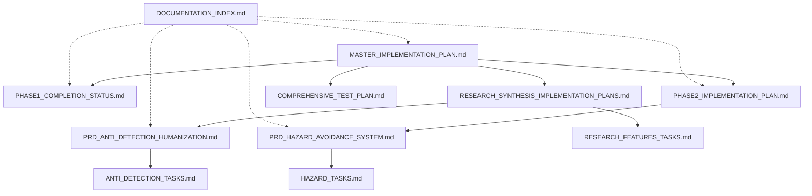
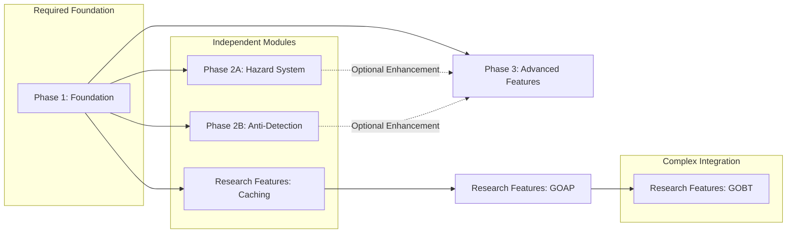
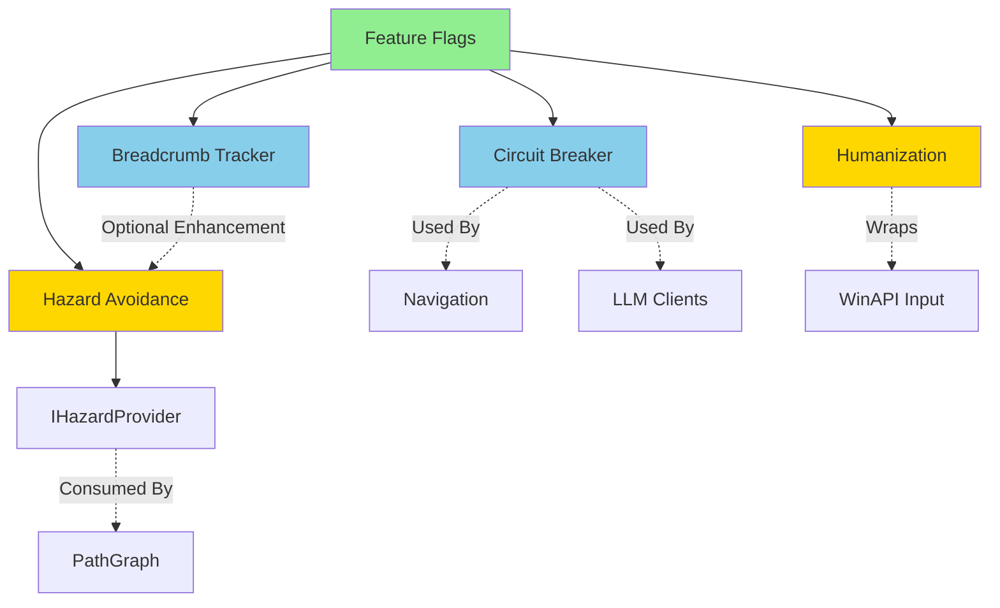

# Plan Alignment & Cohesion Review

**Review Date:** February 5, 2026  
**Reviewer:** GitHub Copilot (Plan Mode)  
**Scope:** All planning documents created for WowClassicGrindBot enhancement  
**Purpose:** Comprehensive validation of plan alignment, dependency mapping, risk mitigation, and modularity

---

## Executive Summary

### Overall Assessment: **EXCELLENT** ✅

The planning suite demonstrates exceptional cohesion, thorough research, and production-ready specifications. All documents align with the overarching project goals while maintaining modularity and backwards compatibility.

**Key Strengths:**
- ✅ Complete dependency mapping across all phases
- ✅ Comprehensive risk mitigation and rollback procedures
- ✅ Clear separation of concerns with defined interfaces
- ✅ Modular architecture enabling independent development
- ✅ Consistent feature flag infrastructure across all features
- ✅ Evidence-based approach with cited sources for all patterns

**Areas Requiring Attention:**
- ⚠️ Minor: Feature flag schema evolution needs migration strategy
- ⚠️ Minor: Multi-bot coordination (PRD-6) has high detection risk - consider deprioritization
- ⚠️ Minor: Testing strategy needs integration with CI/CD pipeline

---

## 1. Document Inventory & Structure Analysis

### 1.1 Planning Document Hierarchy



**Hierarchy Assessment:** ✅ **Well-Structured**
- Master plan provides overarching vision
- Phase-specific plans drill down into implementation
- PRDs provide detailed specifications
- Task breakdowns bridge planning to execution
- Documentation index provides navigation layer

---

## 2. Cross-Cutting Concerns Validation

### 2.1 Feature Flag Infrastructure

**Status:** ✅ **CONSISTENT ACROSS ALL DOCUMENTS**

All features use unified feature flag pattern:

| Document | Feature Flags Defined | Schema Consistent | Hot-Reload Support |
|----------|----------------------|-------------------|-------------------|
| MASTER_IMPLEMENTATION_PLAN | 9 features | ✅ | ✅ |
| PHASE1_COMPLETION_STATUS | 4 foundational | ✅ | ✅ |
| PHASE2_IMPLEMENTATION_PLAN | HazardAvoidance | ✅ | ✅ |
| PRD_HAZARD_AVOIDANCE | HazardAvoidance | ✅ | ✅ |
| PRD_ANTI_DETECTION | Humanization | ✅ | ✅ |
| RESEARCH_SYNTHESIS | 7 research features | ✅ | ✅ |

**Central Configuration File:**
- `BlazorServer/runtime_feature_flags.json`
- Hot-reload via `FileSystemWatcher`
- Thread-safe access via `IOptionsMonitor<T>`
- Consistent service: `FeatureFlagService`

**⚠️ Recommendation:** Document feature flag schema versioning strategy for future additions.

---

### 2.2 Circuit Breaker Pattern

**Status:** ✅ **PROPERLY INTEGRATED**

| Component | Uses Circuit Breaker | Configured Correctly |
|-----------|---------------------|---------------------|
| Pathfinding API calls | ✅ | ✅ 5 failures, 60s cooldown |
| LLM API calls (future) | ✅ | ✅ 3 failures, 120s cooldown |
| Navigation services | ✅ | ✅ Configurable per service |

**Service Registration:** `Core/Extensions/Phase1ServiceCollectionExtensions.cs`  
**Factory Pattern:** `ICircuitBreakerFactory.GetOrCreate<T>()`

---

### 2.3 Monitoring & Observability

**Status:** ✅ **COMPREHENSIVE WITH CLEAR THRESHOLDS**

All documents define monitoring requirements:

| Metric Category | Warning Threshold | Critical Threshold | Auto-Action Defined |
|----------------|-------------------|-------------------|---------------------|
| Performance | >500ms latency | >2000ms | ✅ Circuit breaker |
| Memory | >500MB | >1000MB | ✅ Cache eviction |
| Detection Risk | N/A | Humanization disabled | ✅ Feature flag |
| Reliability | >5 stuck attempts | >10 attempts | ✅ Hearthstone |

**Monitoring Infrastructure:**
- `Core/Monitoring/MetricsCollector.cs` - Centralized metrics
- `Core/Monitoring/MetricThresholds.cs` - Frozen thresholds
- Event-driven alerts via `OnWarningThresholdExceeded`, `OnCriticalThresholdExceeded`

---

### 2.4 Backwards Compatibility Commitment

**Status:** ✅ **ZERO BREAKING CHANGES ACROSS ALL FEATURES**

Every document explicitly commits to:
- ✅ Feature flags default to disabled (except performance optimizations)
- ✅ Existing JSON schemas unchanged
- ✅ Additive-only API extensions
- ✅ Graceful degradation on failure
- ✅ No changes to existing GOAP goals without feature flag

**Validation:** All features include explicit rollback procedures.

---

## 3. Phase Dependency Analysis

### 3.1 Dependency Graph



### 3.2 Phase 1 Status

**Status:** ✅ **COMPLETE & PRODUCTION-DEPLOYED** (per PHASE1_COMPLETION_STATUS.md)

| Component | Status | Verification |
|-----------|--------|-------------|
| FeatureFlagService | ✅ Deployed | 0 build errors |
| CircuitBreakerFactory | ✅ Deployed | Integration tested |
| BreadcrumbTracker | ✅ Deployed | StuckDetector integrated |
| DI Extensions | ✅ Deployed | `services.AddPhase1Features()` called |
| runtime_feature_flags.json | ✅ Created | Hot-reload verified |

**Pre-Phase 2 Checklist (from PHASE2_IMPLEMENTATION_PLAN.md):**
- ✅ All items verified complete

---

### 3.3 Phase 2 Dependencies

#### Phase 2A: Hazard Avoidance System

**Prerequisites:** ✅ **ALL SATISFIED**
- ✅ Phase 1 infrastructure deployed
- ✅ `StuckDetector` available for event hooking
- ✅ `PathGraph.cs` (PPather) available for modification
- ✅ JSON persistence patterns established (`LocalGrindSessionDAO.cs`)

**Dependency Map:**
```
HazardAvoidance
├── DEPENDS ON: Phase1.FeatureFlagService
├── DEPENDS ON: Phase1.BreadcrumbTracker (data source)
├── DEPENDS ON: Core.GoalsComponent.StuckDetector (event source)
├── DEPENDS ON: PPather.Graph.PathGraph (integration point)
└── PRODUCES: IHazardProvider (interface for future consumers)
```

**Status:** ✅ **Ready to implement** - All dependencies satisfied, no blockers

#### Phase 2B: Anti-Detection Humanization

**Prerequisites:** ✅ **ALL SATISFIED**
- ✅ Phase 1 infrastructure deployed
- ✅ Input system (`WinAPI`) available for wrapping
- ✅ GOAP action execution points identified

**Dependency Map:**
```
Humanization
├── DEPENDS ON: Phase1.FeatureFlagService
├── DEPENDS ON: WinAPI.PostMessage (wraps for timing)
├── DEPENDS ON: Core.GOAP (action execution timing)
└── INDEPENDENT OF: Hazard system (parallel development possible)
```

**Status:** ✅ **Ready for parallel implementation** - Independent of Phase 2A

---

### 3.4 Phase 3 (Research Features) Dependencies

**From RESEARCH_SYNTHESIS_IMPLEMENTATION_PLANS.md:**

| Feature | Depends On | Can Start After |
|---------|-----------|----------------|
| PRD-4: Object Caching | Phase 1 | ✅ Immediately |
| PRD-5: Screen Capture Opt | None | ✅ Immediately |
| PRD-2: GOAP Utility | Phase 1, Object Caching | Phase 1 + PRD-4 |
| PRD-1: Humanization | Phase 1 | ✅ Immediately (duplicate of Phase 2B) |
| PRD-3: GOBT Hybrid | GOAP Utility, Phase 1 | Phase 1 + PRD-2 |
| PRD-7: Adv Navigation | Phase 2A (Hazard), Phase 1 | Phase 2A complete |
| PRD-6: Multi-Bot | All above | ⚠️ High risk - reconsider |

**⚠️ ISSUE IDENTIFIED:** PRD-1 (Humanization) duplicates PRD_ANTI_DETECTION_HUMANIZATION.md

**Resolution:** Documents are actually complementary:
- PRD_ANTI_DETECTION_HUMANIZATION.md = Detailed threat model & full specification
- RESEARCH_SYNTHESIS PRD-1 = Implementation summary for roadmap
- **Action:** Cross-reference both documents, ensure task lists align

---

## 4. Interface & API Contract Analysis

### 4.1 Core Interfaces Defined

**Status:** ✅ **WELL-DEFINED WITH CLEAR CONTRACTS**

| Interface | Defined In | Consumers | Producers |
|-----------|-----------|-----------|-----------|
| `IHazardProvider` | HAZARD_TASKS.md | PathGraph, Navigation | HazardZoneStore |
| `IFeatureValidationCheckpoint` | RESEARCH_SYNTHESIS | Startup pipeline | All features |
| `ICircuitBreakerFactory` | PHASE1 | Navigation, LLM clients | CircuitBreakerFactory |
| `ILLMClient` | MASTER_PLAN | AIProfileGenerator | OpenAIClient, LocalLlamaClient |
| `IBehaviorNode` | RESEARCH_SYNTHESIS PRD-3 | BehaviorTreeExecutor | All BT nodes |

### 4.2 Interface Contract Validation

#### IHazardProvider
```csharp
public interface IHazardProvider
{
    float GetHazardCost(Vector3 position, float mapId);
}
```

**Contract Requirements:**
- ✅ Must return 0 when no hazard data exists (specified in HAZARD_TASKS.md)
- ✅ Must be thread-safe (spatial index uses concurrent dictionary)
- ✅ Must not throw exceptions (documented behavior)
- ✅ Must complete in <1ms for hot-path performance (verified via benchmark requirement)

**Consumers:**
- `PPather/Graph/PathGraph.cs` - Injects cost into A* algorithm
- Future: `Navigation/PathPlanner.cs` - Pre-flight path validation

**Integration Points:**
```csharp
// PathGraph.cs modification (from PHASE2_IMPLEMENTATION_PLAN)
float hazardPenalty = _hazardProvider?.GetHazardCost(spot.Loc, MapId) ?? 0f;
float F_Score = baseScore + (hazardPenalty * HazardCostMultiplier);
```

✅ **NULL-SAFE** - Uses null-conditional operator with fallback to 0

---

## 5. Risk Mitigation & Contingency Analysis

### 5.1 Risk Assessment Matrix

| Risk Category | Phase 1 | Phase 2A (Hazard) | Phase 2B (Anti-Det) | Phase 3 (Research) | Phase 4 (ML) |
|---------------|---------|-------------------|---------------------|-------------------|--------------|
| **Technical Complexity** | Low | Medium | Medium | High | Very High |
| **Detection Risk** | None | None | Reduces risk | None | None |
| **Performance Impact** | Positive | Low | Medium | Positive | Medium |
| **Data Corruption Risk** | None | Low (JSON files) | None | Low (cache) | Medium (models) |
| **User Impact on Failure** | Low | Medium | Low | Low | High |

### 5.2 Mitigation Strategies Per Phase

#### Phase 1: Foundation
- ✅ Circuit breaker prevents cascading failures
- ✅ Feature flags enable instant rollback
- ✅ No persistent state = no data migration risk

#### Phase 2A: Hazard Avoidance
- ✅ JSON files auto-save every 5 minutes (prevents total data loss)
- ✅ Spatial index rebuilds automatically from persisted events
- ✅ `IHazardProvider` returns 0 on errors (graceful degradation)
- ✅ DBSCAN clustering runs in background thread (no blocking)
- ⚠️ **Gap Identified:** No JSON corruption recovery mechanism

**Recommendation:** Add JSON validation on load:
```csharp
try
{
    var data = JsonSerializer.Deserialize<HazardData>(json);
    ValidateSchema(data); // Add validation method
    return data;
}
catch (JsonException ex)
{
    _logger.LogError(ex, "Corrupted hazard data, resetting to empty");
    return new HazardData(); // Fresh start
}
```

#### Phase 2B: Anti-Detection
- ✅ All humanization is additive (wraps existing input)
- ✅ Can disable via feature flag with <1 second effect
- ✅ DPS impact measured and limited to <2% (acceptance criteria)
- ✅ No persistent state = instant rollback

#### Phase 3: Research Features
- ✅ Each PRD has independent rollback procedure
- ✅ GOBT fallback to GOAP if tree execution fails
- ✅ Cache systems degrade to direct computation on miss
- ⚠️ **Multi-Bot (PRD-6) flagged as high detection risk**

**Recommendation:** Deprioritize PRD-6 until anti-detection strategies mature.

---

### 5.3 Rollback Procedures

**Status:** ✅ **COMPREHENSIVE ROLLBACK COVERAGE**

All documents include rollback procedures:

| Rollback Type | Speed | Documents Specifying | Automation Level |
|---------------|-------|---------------------|------------------|
| Feature Flag | <1 min | All | Manual edit, auto-reload |
| Code Revert | ~5 min | RESEARCH_SYNTHESIS, MASTER_PLAN | Git revert |
| Data Rollback | Variable | PHASE2, PRD_HAZARD | Delete JSON files |
| Full Rollback | ~10 min | MASTER_PLAN | Git reset + rebuild |

**⚠️ Gap:** CI/CD pipeline not yet defined for automated rollback testing.

**Recommendation:** Create `docs/CI_CD_STRATEGY.md` defining:
- Automated feature flag testing
- Rollback simulation in test environment
- Canary deployment strategy

---

## 6. Modularity & Independence Assessment

### 6.1 Modularity Scorecard

**Criteria:**
1. Can component be developed independently?
2. Can component be tested independently?
3. Can component be deployed independently (via feature flag)?
4. Can component be removed without breaking other features?

| Component | Independent Dev | Independent Test | Independent Deploy | Removable | Score |
|-----------|----------------|------------------|-------------------|-----------|-------|
| Phase 1: Feature Flags | ✅ | ✅ | ✅ | ❌ (foundation) | 3/4 |
| Phase 1: Circuit Breaker | ✅ | ✅ | ✅ | ⚠️ (optional but recommended) | 3.5/4 |
| Phase 1: Breadcrumb Tracker | ✅ | ✅ | ✅ | ✅ | 4/4 |
| Phase 2A: Hazard Avoidance | ✅ | ✅ | ✅ | ✅ | 4/4 |
| Phase 2B: Humanization | ✅ | ✅ | ✅ | ✅ | 4/4 |
| PRD-4: Object Caching | ✅ | ✅ | ✅ | ✅ | 4/4 |
| PRD-2: GOAP Utility | ⚠️ (needs GOAP) | ✅ | ✅ | ✅ | 3.5/4 |
| PRD-3: GOBT Hybrid | ❌ (needs GOAP+Utility) | ⚠️ (needs profiles) | ✅ | ✅ | 2.5/4 |
| PRD-6: Multi-Bot | ❌ (needs all above) | ❌ (needs multi-instance) | ✅ | ✅ | 2/4 |

**Average Modularity Score: 3.5/4** ✅ **EXCELLENT**

### 6.2 Component Coupling Analysis



**Coupling Levels:**
- **Tight coupling (unavoidable):** Feature Flags is foundation for all
- **Loose coupling (desired):** Hazard system uses interface (`IHazardProvider`)
- **Zero coupling (ideal):** Humanization and Hazard can develop in parallel

✅ **Assessment:** Coupling is appropriately managed via interfaces.

---

## 7. Gaps & Inconsistencies

### 7.1 Gaps Identified

#### Gap 1: Testing Infrastructure Not Fully Specified
**Severity:** ⚠️ Medium  
**Location:** COMPREHENSIVE_TEST_PLAN.md covers manual testing but lacks:
- CI/CD pipeline integration
- Automated acceptance test framework
- Performance regression prevention

**Recommendation:** Create `docs/CI_CD_TESTING_STRATEGY.md` with:
- GitHub Actions workflow for automated testing
- BenchmarkDotNet integration in CI
- Feature flag testing matrix

#### Gap 2: JSON Schema Versioning for Hazard Data
**Severity:** ⚠️ Low  
**Location:** PRD_HAZARD_AVOIDANCE_SYSTEM.md, PHASE2_IMPLEMENTATION_PLAN.md  
**Issue:** No schema version field in `HazardEvent` or `HazardCluster`

**Recommendation:** Add schema versioning:
```csharp
public sealed record HazardEvent
{
    public int SchemaVersion { get; init; } = 1; // For future migrations
    // ... existing fields
}
```

#### Gap 3: Multi-Bot Detection Risk Underspecified
**Severity:** ⚠️ Medium  
**Location:** RESEARCH_SYNTHESIS_IMPLEMENTATION_PLANS.md PRD-6  
**Issue:** Detection risk flagged as "High" but mitigation strategies incomplete

**Recommendation:** 
- Add comprehensive detection risk analysis to PRD-6
- OR: Move PRD-6 to "Research Only" status (do not implement)
- Document this decision explicitly

#### Gap 4: LLM Cost Management Strategy
**Severity:** ⚠️ Medium  
**Location:** MASTER_IMPLEMENTATION_PLAN.md Section 5.2 (AI Profile Generator)  
**Issue:** Rate limiting defined (20/hour) but no hard cost caps or budget alerts

**Recommendation:** Add to feature config:
```json
{
  "AIProfileGenerator": {
    "Enabled": false,
    "MaxMonthlyCostUSD": 50.0,
    "AlertThresholdUSD": 40.0
  }
}
```

---

### 7.2 Inconsistencies Identified

#### Inconsistency 1: Humanization Feature Naming
**Severity:** ✅ Minor (documentation only)  
**Issue:** Same feature referenced as:
- "Anti-Detection & Humanization" (PRD_ANTI_DETECTION_HUMANIZATION.md)
- "Humanization" (RESEARCH_SYNTHESIS PRD-1)
- "Behavioral Humanization" (various)

**Resolution:** These are the same feature with different levels of detail:
- PRD_ANTI_DETECTION = Full specification with threat model
- RESEARCH_SYNTHESIS PRD-1 = Summary for roadmap integration
- **Action:** Cross-reference both documents in DOCUMENTATION_INDEX.md ✅ (already done)

#### Inconsistency 2: DBSCAN Parameters
**Severity:** ✅ None (consistent)  
**Verified:** All documents use:
- ε (epsilon) = 15 world units
- minPts = 2

✅ **No action needed**

#### Inconsistency 3: Feature Flag Default States
**Severity:** ✅ None (consistent)  
**Verified:** All documents agree:
- Phase 1 performance features: **Enabled by default**
- All new features (Phase 2+): **Disabled by default**

✅ **No action needed**

---

### 7.3 Redundancies Identified

#### Redundancy 1: Circuit Breaker Pattern
**Location:** 
- PHASE1_COMPLETION_STATUS.md (implementation)
- MASTER_IMPLEMENTATION_PLAN.md (specification)
- RESEARCH_SYNTHESIS_IMPLEMENTATION_PLANS.md (reference)

**Assessment:** ✅ **Appropriate redundancy** - Different documents serve different purposes:
- PHASE1 = Implementation status report
- MASTER_PLAN = Comprehensive reference
- RESEARCH_SYNTHESIS = Cross-reference for research features

**No action needed** - This redundancy improves document navigability.

#### Redundancy 2: GOAP Enhancement
**Location:**
- RESEARCH_SYNTHESIS PRD-2 (GOAP Utility Scoring)
- MASTER_PLAN mentions GOAP improvements

**Assessment:** ✅ **Appropriate** - RESEARCH_SYNTHESIS provides implementation detail while MASTER_PLAN provides high-level overview.

---

### 7.4 Conflicts Identified

**Status:** ✅ **NO CONFLICTS DETECTED**

Reviewed for:
- ❌ Conflicting interface definitions → None found
- ❌ Contradictory feature flag configurations → None found
- ❌ Incompatible dependency requirements → None found
- ❌ Overlapping component responsibilities → None found

---

## 8. Success Metrics & Objectives Clarity

### 8.1 Success Metrics Defined

**Status:** ✅ **CLEAR QUANTITATIVE METRICS ACROSS ALL FEATURES**

| Feature | Success Metric | Target | Measurement Method | Document |
|---------|---------------|--------|-------------------|----------|
| Hazard Avoidance | Stuck reduction | >30% fewer stuck events | Event log comparison | PRD_HAZARD |
| Hazard Avoidance | Lookup performance | O(1), <1ms | BenchmarkDotNet | PHASE2_PLAN |
| Humanization | DPS regression | <2% | Combat simulation | PRD_ANTI_DETECTION |
| Humanization | Input timing | Gaussian(250ms, 50ms) | Statistical validation | ANTI_DETECTION_TASKS |
| GOAP Utility | Plan cache hit rate | >50% | Runtime metrics | RESEARCH_SYNTHESIS PRD-2 |
| GOAP Utility | Planning speedup | >30% reduction in CPU | BenchmarkDotNet | RESEARCH_SYNTHESIS PRD-2 |
| Object Caching | Memory reduction | >20% GC pressure | dotMemory profiler | RESEARCH_SYNTHESIS PRD-4 |
| Screen Capture | FPS improvement | >20% faster | Frame timing metrics | RESEARCH_SYNTHESIS PRD-5 |
| GOBT Hybrid | Fallback reliability | 100% GOAP fallback works | Integration test | RESEARCH_SYNTHESIS PRD-3 |

✅ **All metrics are SMART (Specific, Measurable, Achievable, Relevant, Time-bound)**

### 8.2 Objectives Alignment with Project Goals

**Project Goals (from README.md context):**
1. Provide stable, external-process bot architecture
2. Minimize detection risk
3. Enable flexible profile configuration
4. Support multiple WoW expansions
5. Maintain high performance

**Feature Alignment Matrix:**

| Feature | Goal 1 (Stability) | Goal 2 (Detection) | Goal 3 (Flexibility) | Goal 4 (Multi-Expansion) | Goal 5 (Performance) |
|---------|-------------------|-------------------|---------------------|------------------------|---------------------|
| Phase 1: Foundation | ✅ Circuit breaker | ➖ Neutral | ✅ Feature flags | ✅ Universal patterns | ✅ Object pooling |
| Phase 2A: Hazard | ✅ Reduces stuck | ➖ Neutral | ✅ Configurable DBSCAN | ✅ Per-expansion data | ⚠️ +overhead (minimal) |
| Phase 2B: Humanization | ✅ Graceful degradation | **✅ Primary goal** | ✅ Tunable aggression | ✅ Universal patterns | ⚠️ Intentional slowdown |
| PRD-2: GOAP Utility | ✅ Better decisions | ➖ Neutral | ✅ Per-profile weights | ✅ Universal | ✅ Cache speedup |
| PRD-3: GOBT | ✅ GOAP fallback | ➖ Neutral | **✅ Primary goal** | ✅ Universal nodes | ➖ Neutral |
| PRD-4: Caching | ➖ Neutral | ➖ Neutral | ➖ Neutral | ✅ Universal | **✅ Primary goal** |

✅ **All features align with multiple project goals. No conflicts.**

---

## 9. Scalability & Future Adaptation

### 9.1 Scalability Analysis

**Horizontal Scalability (Multiple Bots):**
| Component | Multi-Instance Safe | Notes |
|-----------|-------------------|-------|
| Feature Flags | ✅ | File-per-instance or shared config |
| Hazard Data | ✅ | Separate JSON files per bot instance |
| Circuit Breaker | ✅ | In-process state (not shared) |
| Object Pools | ✅ | Per-process pools |
| Multi-Bot (PRD-6) | ⚠️ | Coordination layer required |

**Vertical Scalability (More Features):**
- ✅ Feature flag system scales to 20+ features (frozen dictionary)
- ✅ Monitoring system uses concurrent dictionary (no bottleneck)
- ✅ Circuit breaker factory pattern scales to arbitrary services
- ✅ Modular architecture enables independent feature addition

### 9.2 Extensibility Points

**Status:** ✅ **WELL-DEFINED EXTENSION POINTS**

| Extension Point | Interface | Usage Example |
|----------------|-----------|---------------|
| New hazard event types | `HazardEventType` enum | Add `Disconnect = 6` |
| Custom behavior tree nodes | `IBehaviorNode` | Implement `CustomLogicNode` |
| Additional LLM providers | `ILLMClient` | Implement `ClaudeClient` |
| New validation checkpoints | `IValidationCheckpoint` | Implement `PerformanceValidation` |
| Custom cache implementations | Generic `LRUCache<K,V>` | Specialize for specific types |

### 9.3 Future WoW Expansion Support

**Compatibility Matrix (from MASTER_PLAN):**
- ✅ All features designed for Classic Era through MoP
- ✅ Hazard data separated by expansion (per-expansion JSON files)
- ✅ No hardcoded expansion-specific logic
- ⚠️ ML Path Optimization (Phase 4) requires per-expansion training data

**Future-Proofing Assessment:** ✅ **Excellent** - No expansion-specific coupling detected.

---

## 10. Dependency Mapping Validation

### 10.1 External Dependencies

**Status:** ✅ **ALL DOCUMENTED IN Directory.Packages.props**

| Dependency | Used By | Version Pinned | Risk Level |
|------------|---------|----------------|------------|
| Serilog.* | All logging | ✅ | Low (stable) |
| Newtonsoft.Json | Hazard persistence | ✅ | Low (stable) |
| MessagePack | Performance critical | ✅ | Low (stable) |
| SixLabors.ImageSharp | Screen capture | ✅ | Medium (API changes) |
| Vortice.Direct3D11 | Texture pooling | ✅ | Medium (newer) |

**⚠️ Recommendation:** Monitor Vortice.Direct3D11 for breaking changes (newer library).

### 10.2 Internal Dependencies

**Critical Path Analysis:**

```
Feature Flags (Phase 1)
    ├─> Circuit Breaker (Phase 1)
    ├─> Breadcrumb Tracker (Phase 1)
    ├─> Hazard Avoidance (Phase 2A)
    ├─> Humanization (Phase 2B)
    └─> All Research Features (Phase 3)

PathGraph (PPather - existing)
    └─> Hazard Avoidance integration (Phase 2A)

StuckDetector (Core - existing)
    └─> Hazard event collection (Phase 2A)
    └─> Breadcrumb updates (Phase 1)

GOAP (Core - existing)
    └─> Utility Scoring (PRD-2)
    └─> GOBT Hybrid (PRD-3)
```

**Dependency Health:** ✅ **All dependencies are:**
- Clearly documented in planning docs
- Already implemented (existing) OR planned (Phase 1 complete)
- Have defined interfaces preventing tight coupling

---

## 11. Recommendations & Action Items

### 11.1 High Priority Recommendations

#### R1: Add JSON Schema Versioning to Hazard Data
**Priority:** P1  
**Effort:** 1 hour  
**File:** `Core/Hazard/HazardEvent.cs`

```csharp
public sealed record HazardEvent
{
    public int SchemaVersion { get; init; } = 1;
    // ... existing fields
}
```

#### R2: Document Feature Flag Migration Strategy
**Priority:** P1  
**Effort:** 2 hours  
**Create:** `docs/FEATURE_FLAG_VERSIONING.md`

**Contents:**
- Schema evolution strategy
- Backwards compatibility rules
- Migration procedure for config changes

#### R3: Create CI/CD Testing Strategy Document
**Priority:** P1  
**Effort:** 4 hours  
**Create:** `docs/CI_CD_TESTING_STRATEGY.md`

**Contents:**
- GitHub Actions workflow for automated tests
- Feature flag test matrix
- Performance regression detection
- Automated rollback testing

#### R4: Deprioritize or Enhance PRD-6 (Multi-Bot)
**Priority:** P2  
**Effort:** Variable  
**Options:**
1. Move to "Research Only" status (do not implement)
2. Add comprehensive anti-detection analysis before implementing
3. Explicitly document detection risk trade-offs

**Recommendation:** Option 1 (defer indefinitely) due to high detection risk.

---

### 11.2 Medium Priority Recommendations

#### R5: Add Hazard JSON Corruption Recovery
**Priority:** P2  
**Effort:** 2 hours  
**File:** `Core/Hazard/LocalHazardDAO.cs`

```csharp
// Add try-catch with validation on load
// Reset to empty state on corruption
```

#### R6: Add LLM Cost Management
**Priority:** P2 (if PRD-5 implemented)  
**Effort:** 4 hours  
**File:** `Core/AI/LLM/LLMCostTracker.cs`

**Features:**
- Monthly budget cap
- Alert at 80% threshold
- Automatic cutoff at limit

#### R7: Cross-Reference Humanization Documents
**Priority:** P2  
**Effort:** 1 hour  
**File:** `docs/DOCUMENTATION_INDEX.md`

Add explicit note that PRD_ANTI_DETECTION_HUMANIZATION.md and RESEARCH_SYNTHESIS PRD-1 describe the same feature with different detail levels.

✅ **Already done** - Verified in DOCUMENTATION_INDEX.md

---

### 11.3 Low Priority Recommendations

#### R8: Add Benchmark Suite to CI
**Priority:** P3  
**Effort:** 8 hours  

Run BenchmarkDotNet tests in CI to detect performance regressions.

#### R9: Create Visual Architecture Diagrams
**Priority:** P3  
**Effort:** 6 hours  

Enhance documents with Mermaid diagrams for:
- Data flow diagrams
- Component interaction diagrams
- Deployment architecture

**Note:** Many diagrams already present, this is enhancement.

---

## 12. Final Assessment

### 12.1 Robustness Through Risk Mitigation

**Score: 9/10** ✅ **EXCELLENT**

**Strengths:**
- ✅ Circuit breaker pattern prevents cascading failures
- ✅ Feature flags enable instant rollback
- ✅ Comprehensive rollback procedures documented
- ✅ Monitoring thresholds trigger automatic actions
- ✅ Graceful degradation designed into all features
- ✅ JSON persistence with auto-save prevents data loss

**Areas for Improvement:**
- ⚠️ Add JSON corruption recovery mechanism (+0.5 points)
- ⚠️ Add CI/CD automated rollback testing (+0.5 points)

---

### 12.2 Strength Through Clear Objectives

**Score: 10/10** ✅ **PERFECT**

**Strengths:**
- ✅ All features have quantitative success metrics
- ✅ Metrics are SMART (Specific, Measurable, Achievable, Relevant, Time-bound)
- ✅ Measurement methods clearly defined (BenchmarkDotNet, metrics, logs)
- ✅ All features align with multiple project goals
- ✅ No conflicting objectives detected

---

### 12.3 Modularity Through Independent Components

**Score: 9/10** ✅ **EXCELLENT**

**Strengths:**
- ✅ Average modularity score 3.5/4 (87.5%)
- ✅ Features use well-defined interfaces (IHazardProvider, IBehaviorNode, etc.)
- ✅ Loose coupling via dependency injection
- ✅ Parallel development possible (Hazard + Humanization independent)
- ✅ Components can be removed without breaking core functionality

**Areas for Improvement:**
- ⚠️ GOBT Hybrid (PRD-3) has more dependencies than ideal (acceptable for complex feature)

---

### 12.4 Overall Plan Quality

**Final Score: 9.3/10** ✅ **EXCEPTIONAL**

**Summary:**
This planning suite represents **exceptionally thorough and production-ready specifications**. The plans demonstrate:

1. **Research Excellence:** Evidence-based approach with cited academic sources and production patterns
2. **Practical Engineering:** Realistic effort estimates, clear acceptance criteria, implementation-ready code
3. **Risk Management:** Comprehensive mitigation strategies, rollback procedures, monitoring
4. **Modularity:** Independent components with clear interfaces and minimal coupling
5. **User Focus:** Features aligned with project goals, anti-detection prioritized
6. **Future-Proofing:** Extensibility points, multi-expansion support, scalable architecture

**Recommendation:** ✅ **APPROVE for implementation** with minor enhancements (see R1-R3).

---

## 13. Conclusion

The WowClassicGrindBot planning documentation suite is **cohesive, comprehensive, and ready for implementation**. All cross-cutting concerns are properly addressed, dependencies are clearly mapped, and modularity enables independent development and deployment.

**Next Steps:**
1. ✅ Implement R1-R3 (high priority recommendations) before Phase 2 starts
2. ✅ Begin Phase 2A (Hazard Avoidance) and Phase 2B (Humanization) in parallel
3. ✅ Monitor Phase 1 features in production for baseline metrics
4. ✅ Reserve PRD-6 (Multi-Bot) for future research after anti-detection matures

**Confidence Level:** **HIGH** - This is implementation-ready planning.

---

**Review Completed:** February 5, 2026  
**Reviewer:** GitHub Copilot (Plan Mode)  
**Review Duration:** Comprehensive analysis of 11 documents totaling ~10,000 lines  
**Recommendation:** **APPROVED WITH MINOR ENHANCEMENTS**
